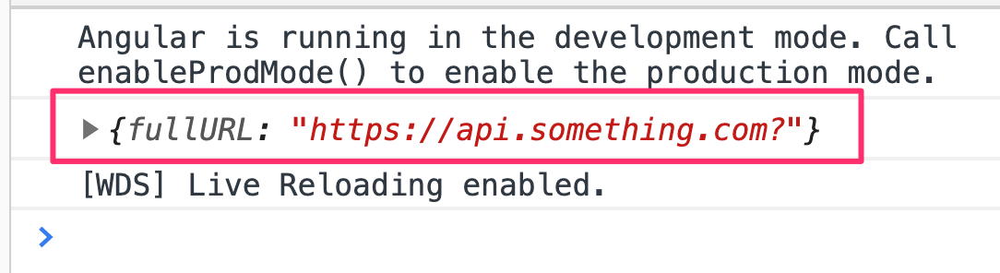
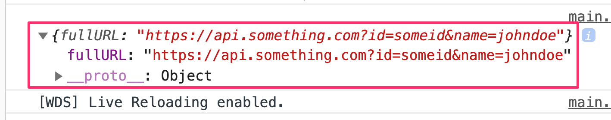
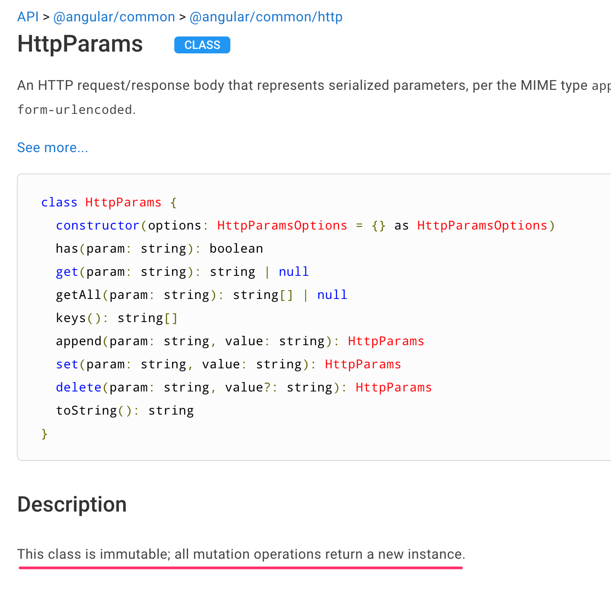

Today I learned how to create a URL with query string parameters with [HttpParams](https://angular.io/api/common/http/HttpParams) class in Angular

I want to construct a URL with some query string parameters like:
`https://api.something.com?id=someid&name=johndoe`

I try:

```ts
import { HttpParams } from '@angular/common/http';

...
const baseURL = 'https://api.something.com';
const params = new HttpParams();

params.set('id', 'someid');
params.set('name', 'johndoe');

const fullURL = `${baseURL}?${params.toString()}`;
console.log({ fullURL });
```

The URL doesn't contain any parameters.



But when I chain `.set()` with `new HttpParams()`, it works.

```ts
const params = new HttpParams()
	.set('id', 'someid');
	.set('name', 'johndoe');

const fullURL = `${baseURL}?${params.toString()}`;
console.log({ fullURL });
```



-----

My gotcha moment was then I found out that `HttpParams` class in Angular **is immutable**.



So, `params.set()` method doesn't modify an exsting `params` object;
it returns **a new `HttpParams` instance**.

The method's signature is

```ts
set(param: string, value: string): HttpParams;
```

So if I want the `params` object with a new parameter in it,
I have to put it in a variable, or reassign to itself.

```sh
let params = new HttpParams();
params = params.set('id', 'someid');
params = params.set('name', 'johndoe');
```

It is opposed to the [native `URLSearchParams`](https://developer.mozilla.org/en-US/docs/Web/API/URLSearchParams),
or the deprecated [`URLSearchParams` in `@angular/http`](https://v2.angular.io/docs/ts/latest/api/http/index/URLSearchParams-class.html) module,
which are both mutable.


## Why?

I looked up on Google search to find why Angular team
decided to make HttpParams immutable.

I found [this post from Sparkles Blog](https://medium.com/sparkles-blog/angular-httpclient-enforces-immutability-dad161d8714b)
which leads to the official document about immutability of `HttpRequest` and `HttpResponse` classes' properties

<blockquote>
	<p>[...] They are immutable for a good reason: the app may retry a request several times before it succeeds, which means that the interceptor chain may re-process the same request multiple times.</p>
	<p>If an interceptor could modify the original request object, the re-tried operation would start from the modified request rather than the original. Immutability ensures that interceptors see the same request for each try.</p>
	<cite>Source - <a href="https://angular.io/guide/http#immutability">Http Guide</a>, Angular.io</cite>
</blockquote>

Then it is kind of make sense to me too if the `HttpParams` class should be also immutable.

However, we still cannot always assume that everying is immutable,
as mention in another API document page:
[Instances of HttpRequest class should not be assumed to be immutable](https://angular.io/api/common/http/HttpRequest).

Hmm.. 🤔


