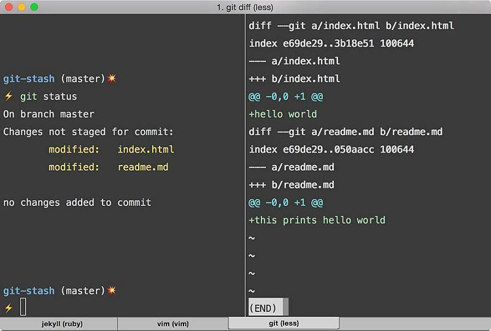
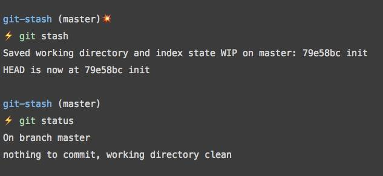
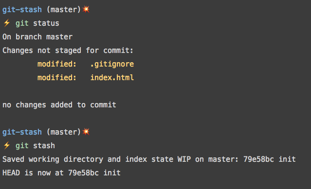
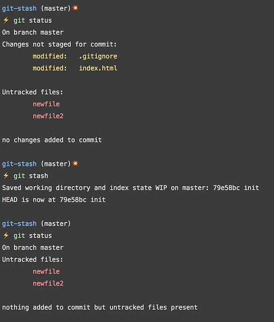
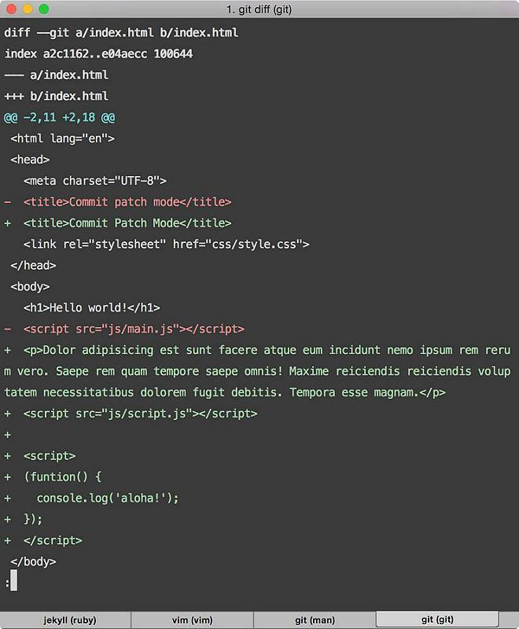
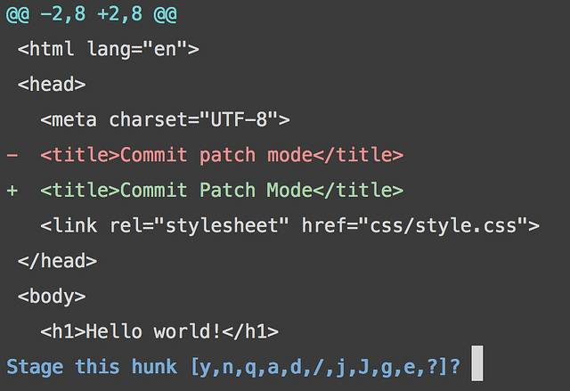
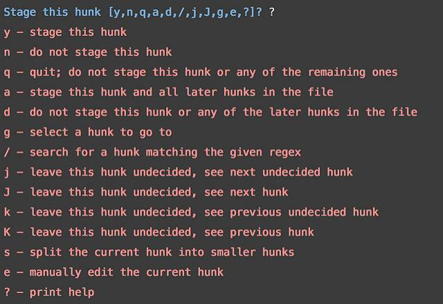
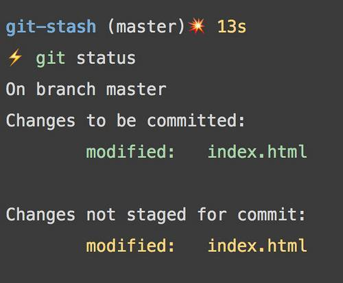
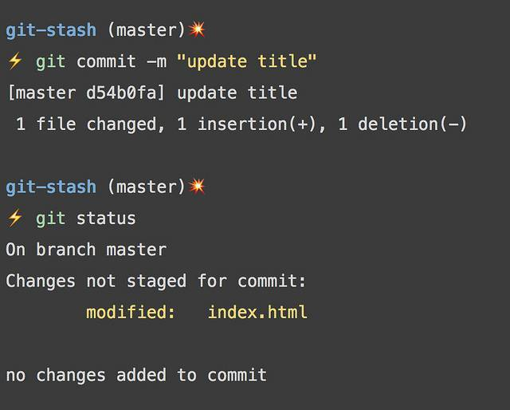

(สถานการณ์จำลอง)

- A: (coding อย่างขะมักเขม้น)
- B1: "แก้ bug ตรงนี้ให้หน่อย แป๊ปเดียว"
- B2: "เพิ่ม feature นี้หน่อย ลูกค้าอยากได้"
- (B1 และ B2 ประสานเสียงพร้อมกัน): **เอาตอนนี้เลย**
- A: ...

(สถานการณ์จำลอง 2)

- A: (coding อย่างขะมักเขม้น)
- C: (เป็น dev ด้วยกัน) "pull branch X ไป review code/run หน่อย เพิ่ง push ไป"
- A: ...

การมี `git` นั้นทำให้เราสามารถทำ snapshot ของงานส่วนที่เรากำลังทำอยู่ได้ โดยไม่ไปทำของคนอื่นพัง และงานเราไม่หายด้วย ปกติผมจะใช้ 2 command นี้ครับ

## 1. `git stash`

`git stash` ถ้าแปลตรงตัวก็แปลว่า "ซ่อน" code ของเราไว้ก่อน โดย code ที่เราซ่อนไว้จะถูกเก็บใน stash stack และทำให้ repo ของเรา clean เมื่อ stash ไว้แล้วครับ

ตัวอย่างเช่น ใน repo ของเรามี dirty file จาก `git status` (ข้างขวาเป็น output ของ `git diff`)

เราอยากซ่อน changes ของทั้ง 2 file นี้ไว้ ก็ใช้คำสั่ง `git stash`


$ git stash


repo ของเราก็จะกลับมา clean เหมือนเดิม โดยคำสั่ง stash จะบอก HEAD commit hash ว่า repo ของเราถูก revert ไปที่ commit ใด (ปกติก็เป็น commit ล่าสุดก่อนที่มันจะ dirty แหละ)

ถ้าเราแก้ code ไปแล้ว อยาก stash อีก ก็ทำได้ โดยที่ stash ครั้งต่อๆ ไปจะถูกเก็บใน stack เรียกดูได้จาก command `git stash list`


$ git stash list


เอา code ที่ stash ไว้ ออกมาจาก stack เพื่อทำงานต่อ ใช้ command `git stash pop`

และเนื่องจากมันเป็น stack เวลา pop มันเลยเอา stash ล่าสุดออกมาก่อน ซึ่งพอ pop ออกมาแล้ว stash นั้นก็จะหายไปจาก list ครับ (ถ้าอยาก pop แบบไม่ให้มันหาย ใช้ command `git stash apply` แทน)

### `git stash` กับ untracked file

ปกติแล้ว `git stash` จะไม่เก็บไฟล์ที่ untracked ไปด้วย (ไฟล์ที่ยังไม่ได้ add ใน git)

ต้องเพิ่ม parameter `-u` เข้าไปด้วย ให้มัน stash ไฟล์ที่ untracked ไปด้วยครับ

พอ pop ออกมา ไฟล์ที่เป็น untracked file ก็ยังอยู่ครบเหมือนเดิม

workflow คร่าวๆ ก็คือ stash งานของเราไว้ก่อน > ทำส่วนอื่นให้เสร็จ > push งานใหม่ไป > pop stash ออกมาทำต่อ ประมาณนี้ครับ

## 2. `git add/commit -p`

`--patch` หรือ `-p` เป็น parameter ของ command `git add` และ `git commit` ทำให้เราสามารถเลือก add หรือ commit เฉพาะบางส่วนของ code ที่เราแก้ไขไปแล้ว โดย code ส่วนที่เหลือ ก็ยังคงเป็นสถานะ modified (unstaged) อยู่

ตัวอย่างเช่น ผมมีไฟล์ `index.html` ที่อัพเดท code ไปบางส่วนแล้ว รัน `git diff` แล้วได้ออกมาแบบนี้

รัน `git add -p index.html` git จะแบ่ง code ออกเป็นส่วนย่อยๆ (hunks) แล้วให้เรารีวิวว่า จะเลือกทำอะไรกับ hunk นั้นๆ รูปข้างล่างนี้จะเห็นว่ามี prompt ให้มาให้เราเลือก ซึ่งตัวเลือกก็มี `y` `n` `q` `a` `d` `/` `j` `J` `g` `e` และก็ `?` ซึ่งเราสามารถเลือก `?` แล้วกด enter เพื่อดูความหมายของแต่ละตัวเลือกได้ (ผมเองก็ไม่เคยจะจำได้เหมือนกัน)

ที่ผมใช้บ่อยๆ ก็จะมี

- `y` หรือ yes เพื่อ add hunk นี้เข้า staged zone
- `n` หรือ no ยังไม่ add hunk นี้
- `q` หรือ quit ออกจาก interactive mode (หยุดการทำงานของ `git add -p`)
- `s` หรือ split ซอย hunk นี้ให้เล็กลงกว่าเดิม

ตัวเลือก `s` นั้นมีประโยชน์มาก เนื่องจากปกติแล้ว git จะแบ่ง code ออกเป็น hunk ให้เอง โดยที่ code ที่อยู่ใกล้ๆ กันรวมเป็น hunk เดียวกัน ซึ่งจริงๆ แล้ว code ที่อยู่ใกล้กันนั้นอาจจะเป็นคนละส่วนกันก็ได้ _(จริงๆ แล้ววิธีการแบ่ง hunk ของ git นั้นมีหลักเกณฑ์มากกว่านี้ แต่ขอข้ามไปละกันครับ ผมเองไม่ได้เข้าใจทั้งหมดเหมือนกัน)_

อย่างตอนนี้ผม add เฉพาะ hunk แรก พอรัน `git status` ก็จะเห็นสถานะทั้ง staged และ modified (unstaged) จากไฟล์เดียวกัน

ซึ่งพอ commit ไปแล้ว code ส่วนยังเหลือ ก็ยังอยู่ในสถานะ modified (unstaged) เหมือนเดิม

### สรุป

- `git stash` เอาไว้ซ่อน modified code และทำให้ repo ของเรากลับมา clean เทียบจาก commit ล่าสุด
- `git stash pop` เรียก code ที่ stash ไว้ล่าสุดออกมา
- `git add(commit) -p` add หรือ commit ทีละส่วนของ code แบบ interactive

ในชีวิตประจำวัน ผมจะใช้ `git add -p` เกือบทุกครั้ง หลักๆ เพื่อเลือก add/commit เฉพาะเท่าที่จำเป็น กรองเอา code ขยะออก และได้โบนัสเป็นการ review code ที่ตัวเองเขียนไปในตัวด้วย ส่วน `git stash` นั้น นานๆ จะได้ใช้ทีนึงครับ
