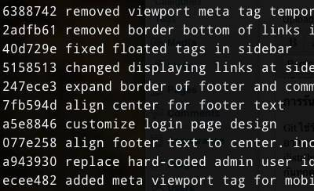

---
categories:
  - Web Development
comments: true
date: 2012-02-26T12:49:24Z
description:
  ความแตกต่างหลักของ Git กับ SVN คือ Git เป็น distributed แต่ SVN นั้นเป็น
  centralized version control system ทำให้เกิดความแตกต่างข้ออื่นๆ ตามมาด้วยครับ
slug: git-vs-svn
keywords:
  - Git
  - Subversion
  - SVN
  - Version Control
title: ความแตกต่างระหว่าง Git กับ SVN
url: /2012/02/26/git-vs-svn/
---

บริษัทที่ผมทำงานอยู่ใช้ **Git** เป็น version control system ครับ ก่อนหน้านี้ผมเคยศึกษาและลองใช้ Subversion (SVN) ดูบ้างตอนฝึกงาน และตอนทำโปรเจ็คจบ พี่เต้ ([@siwawong](https://twitter.com/siwawong)) เคยถามไว้นานแล้วว่า Git กับ SVN นั้นต่างกันยังไง ผมก็เลยลองไปค้นข้อมูลดูครับ

> ผมไม่เคยใช้ SVN ในการทำงานจริง (แบบที่มีทีมหลายๆ คน) เพราะฉะนั้นเรื่องลึกๆ ของ SVN ผมจะไม่ค่อยรู้นะครับ

ไม่ขอลงรายละเอียดว่า Git หรือ SVN คืออะไรนะครับ ลองตามไปอ่านได้ที่ เว็บไซต์ของ [Git](http://git-scm.com/) และ ​[SVN](http://subversion.tigris.org/) ได้เลยครับผม

### Distributed vs. Centralized

เต็มๆ ก็คือ Git เป็น distributed version control system ที่เราสามารถแยก version control ออกเป็น repo ย่อยๆ ได้ แต่ละ repo ย่อยก็สามารถทำ versioning ของตัวเองได้อีกที (เป็น local repo ที่ไม่เกี่ยวกับ remote repo เลย) ส่วน SVN นั้นเป็น centralized version control system คือ version ทั้งหมดจะถูกเก็บที่ remote repo ดังนั้น version ของทุกคนในทีมก็จะตรงกันทั้งหมด ไม่มี local repo ครับ

ประเด็นนี้ก็เลยทำให้ Git สามารถทำงานแบบ offline ได้ คือ clone repo มาแล้วจะแก้ไขโค้ดแล้ว commit ไปยัง local repo ก่อนได้ ส่วน SVN นั้น ทุกครั้งที่ commit นั้นต้องไปอัพเดท version กับ server (commit ไปยัง SVN server) ถ้า offline อยู่ หรือเชื่อมต่อกับ server ไม่ได้ ก็จะไม่สามารถ commit ได้ครับ

### การรันเลข revision

Git ใช้รันเลข revision ด้วย hashed string เช่น `247ece...8a8572` ส่วน SVN นั้นรันเป็นเลข integer ธรรมดา เหตุผลที่เป็นแบบนี้เพราะถ้า Git ใช้ integer ก็อาจจะทำให้ revision number ของเราใน local repo ไปชนกับของคนอื่นได้ (เช่น version 3 ใน repo ของเรา อาจไม่เหมือนกัน version 3 ในเครื่องของเพื่อน ซึ่งเกิดขึ้นได้เพราะมันเป็น distributed นี่แหละ) สำหรับ SVN รันเป็น integer ได้เพราะทุกครั้งที่ commit การ commit นั้นก็จะพุ่งไปยัง SVN server เลย และเลข revision ก็จะถูกเพิ่มไปอีก 1 ดังนั้นเลข revision ต้องตรงกันทุกคนอยู่แล้ว

### การทำ Branch

ก็คือการแตกหน่อ repo ออกมาเป็นอีกหน่อนึง ก็ต่อเนื่องมาจากข้อแรกครับ การที่ Git เป็น distributed ทำให้เราสามารถสร้าง local branch ที่ไม่เกี่ยวของกับชาวบ้านได้ไม่จำกัด (ในกรณีที่เราต้องการทำอะไรแปลกๆ แต่ไม่อยากให้กระทบกับคนในทีมด้วย) ส่วน SVN นั้น branch ต่างๆ ก็ต้องอยู่ที่ SVN server ด้วย ดังนั้นถ้ามี branch ใหม่งอกออกมา ทุกคนในทีมก็จะได้เหมือนๆ กันครับ

แต่ Git ก็ยังสามารถทำ remote branch ได้โดยการ push local branch ไปยัง remote repo ได้ครับ

ประเด็นสำคัญๆ ก็คงประมาณนี้ครับ จะเห็นได้ว่าทุกอย่างล้วนต่อมาจากข้อแรก (distributed & centralized) ซึ่งต่างกันตั้งแต่ออกแบบแล้ว นอกจากนี้ก็ยังมีประเด็นยิบย่อยอีกมากมาย (ขนาด repo, ความเร็ว, ฯลฯ) ลองตามไปอ่านต่อได้ที่

- [5 Fundamental differences between GIT & SVN](http://boxysystems.com/index.php/5-fundamental-differences-between-git-svn/)
- [Git SVN Crash Course](https://git.wiki.kernel.org/articles/g/i/t/GitSvnCrashCourse_512d.html)
- [Git As A Subversion Replacement (Slide)](http://www.slideshare.net/technicalpickles/git-as-a-subversion-replacement) (แนะนำ)

ใครใช้งานตัวไหน คล่องตัวไหน ก็มาแชร์ไอเดียกันได้ครับผม
