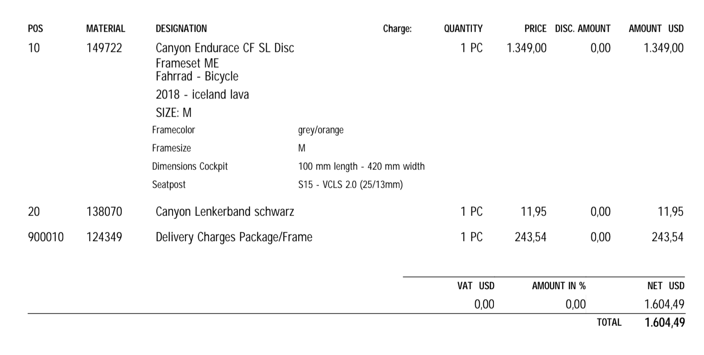

ผมสั่งซื้อจักรยานจาก Canyon เมื่อไม่กี่เดือนก่อน จึงอยากจะเขียนรีวิวขั้นตอนการสั่งซื้อจักรยานจาก canyon.com เก็บไว้ สำหรับคนที่สนใจครับ

รุ่นที่สั่งซื้อเป็นเฟรมเซ็ต Canyon Endurace CF SL รุ่นเกียร์ธรรมดา (Mechanical) เป็นเฟรม disc brake ครับ

โพสต์นี้จะขอเล่าถึงเฉพาะขั้นตอนการสั่งซื้อ แต่ขอยังไม่กล่าวถึงตัวจักรยานนะครับ ไว้จะรีวิวตัวจักรยานในตอนต่อๆ ไป

## เกริ่นนำ

Canyon เป็นแบรนด์จักรยานยักษ์ใหญ่จากประเทศเยอรมนีที่ขายจักรยานของตนเองผ่านเว็บไซต์ canyon.com เพียงช่องทางเดียว
ไม่มีตัวแทนผู้นำเข้าและผู้จำหน่ายในแต่ละประเทศเหมือนยี่ห้ออื่นๆ

หมายความว่าถ้าเราอยากได้จักรยาน Canyon ก็ต้องสั่งซื้อผ่านเว็บไซต์เท่านั้น จ่ายเงินด้วยบัตรเครดิตบนเว็บไซต์ของ Canyon เอง
แล้วจักรยานจะถูกส่งมาจากประเทศเยอรมนีตรงถึงบ้านเราเลย

ซึ่งนอกจากจะต้องจ่ายเงินค่าจักรยานแล้ว ต้องจ่ายค่าขนส่ง และภาษีนำเข้า ในอัตราที่แตกต่างกันออกไปตามแต่ละประเทศครับ (รายละเอียดจะเล่าถึงต่อไป)

ฟังดูเป็นเรื่องยุ่งยากไปหน่อยสำหรับบ้านเรา เลยมีร้านที่รับหน้าที่สั่งซื้อจักรยานจาก Canyon ให้โดยเฉพาะ คือสั่งซื้อกับทางร้าน จ่ายเงินกับทางร้าน แล้วทางร้านจะจัดการสั่งซื้อจาก Canyon ให้อีกที ที่ผมรู้จักก็มีเพจ Canyon Bike Thailand กับ JJ Canyon Bike (ไม่ได้โฆษณา)

ส่วนราคาก็แล้วแต่ร้านจะกำหนด ส่วนมากมักจะไม่ได้แพงกว่าซื้อเองเท่าไหร่ เผลอๆ บางทีอาจจะถูกกว่าด้วยซ้ำ

สรุปง่ายๆ ก็คือ ถ้าคุณอยากซื้อจักรยาน Canyon จากเมืองไทย มี 2 ทางเลือก คือ 1) สั่งซื้อเองจาก canyon.com หรือ 2) ซื้อกับร้านที่เป็นนายหน้าซื้อให้อย่างข้างบน ในกรณีที่ไม่อยากเป็นธุระซื้อเอง

ผมเลือกทางเลือกแรก: สั่งซื้อเอง เพราะอยากรู้ว่า "ประสบการณ์" การสั่งซื้อจักรยานจาก Canyon จะเป็นอย่างไร จะดีหรือไม่ดีก็จะได้รู้กันไปเลย

## 1. เลือกรุ่น ดูราคา

ขั้นตอนแรกคือเข้าไปที่เว็บ canyon.com ก่อน ถ้าเข้าจากเมืองไทยก็จะถูก redirect
ไปที่ https://www.canyon.com/en-th/ โดยอัตโนมัติ หรือไม่ก็เลือกเปลี่ยนได้จากเมนู

ราคาและสกุลเงินที่แสดงก็จะเปลี่ยนไปตามประเทศที่เลือก ราคาอาจจะแตกต่างกันเล็กน้อยครับ
และบางประเทศก็ไม่ได้มีจำหน่ายครบทุกรุ่นครับ

สำหรับประเทศไทย จะแสดงราคาเป็นหน่วยดอลล่าห์สหรัฐ (USD) เป็นราคาที่ถูกหักภาษี EU ออกไปแล้ว เพราะเราไม่ต้องจ่ายภาษี EU แต่ต้องจ่ายเป็นภาษีนำเข้าแทนครับ (เรื่องภาษีเดี๋ยวว่ากันต่อ)

เลือกรุ่นจักรยานได้จากเมนูด้านบนเลย แบ่งรุ่นไว้ชัดเจน

พอกดเข้าไปก็ต้องเลือกรุ่นย่อยอีกที ซึ่งแต่ละรุ่นก็อาจจะมีรุ่นย่อยไม่เหมือนกัน อย่างเช่นรุ่น Endurace ที่ผมเลือก ก็จะมีรุ่นย่อยคือ

- CF SLX (คาร์บอน) รุ่นท็อป มีเฉพาะดิสก์เบรค
- CF SL (คาร์บอน) รุ่นรองท็อป มีเฉพาะดิสก์เบรคเหมือนกัน
- CF (คาร์บอน) เป็น generation ก่อนหน้ารุ่นล่าสุด มีเฉพาะริมเบรค
- AL (อะลูมีเนียม) มีทั้งดิสก์เบรคและริมเบรค

_\* แต่ละรุ่นหลักอาจจะมีรุ่นย่อยไม่เหมือนกัน และบางรุ่นย่อยอาจจะมีขายแบบ complete bike เท่านั้น ไม่มีเฉพาะเฟรมเซ็ต ต้องเช็คดูก่อนครับ_

เมื่อกดเลือกรุ่นย่อยเข้าไปแล้ว ก็จะมีหลายสเป็คและราคาให้เลือก พร้อมกับสีที่มีให้เลือกในแต่ละสเปค

รุ่นที่กำลังลดราคาจะมีป้ายส้มๆ บอกไว้ชัดเจน

กดเข้าไปดูสเป็คอย่างละเอียดได้ทุกคัน

แต่ละคันจะมีราคาบอกไว้ชัดเจนใต้รูปภาพ พร้อมทั้งระบุว่า**มีค่าใช้จ่ายเพิ่มเติมทั้งค่าบรรจุกล่องกับค่าขนส่ง**
/ ราคานี้ถูกหัก VAT. ออกแล้ว

กด link "SHIPPING" เพื่อไปดูค่าขนส่งได้ ซึ่งค่าส่งจะกำหนดไว้แน่นอน ไม่ได้ขึ้นอยู่กับว่าราคาสินค้าจะเท่าไหร่ (ค่าส่งแบบสั่งซื้อทั้งคัน (complete bike) กับแบบเฟรมเซ็ตจะไม่เท่ากัน)

ค่าส่งแพงขนาดนี้เพราะ Canyon ใช้ขนส่งด่วนเพียง 2 เจ้าเท่านั้นคือ DHL กับ UPS นั่นเอง

### วิธีคำนวนราคา

ที่เราต้องจ่ายให้กับ Canyon คือ **ราคาจักรยาน + ค่าขนส่ง** ตัวอย่างเช่น

- เฟรมเซ็ต Endurace CF SL ราคาระบุไว้หน้าเว็บ $1,349
- ค่าขนส่ง $243.54
- รวมที่ต้องจ่ายตอนกดสั่งซื้อ = $1,349 + $243.54 = **$1,592.54**

เพราะฉะนั้น เวลาคำนวนราคาของรุ่นที่เล็งไว้ อย่าลืมบวกค่าขนส่งก่อน แล้วค่อยคำนวนเป็นเงินบาทครับ

## 2. สั่งซื้อและจ่ายเงิน

เมื่อตัดสินใจเลือกรุ่นที่ต้องการได้แล้ว ก็กดปุ่ม ADD TO CART จะมี pop up มาให้เราเลือกสีและไซส์รถที่ต้องการ แต่ละไซส์จะมีสถานะบอกไว้ข้างใต้

- `FROM STOCK` - มีของพร้อมส่ง
- `SOLD OUT` - ของหมด รอผลิต (ยังไม่มีกำหนด ต้องรอไปก่อน)
- (มีวันที่บอก) - กำลังอยู่ในขั้นตอนการผลิต จะพร้อมส่งตามวันที่ที่ระบุไว้

## 3. แก้ไข order

## 4. ติดตาม shipping

## 5. ขั้นตอนการนำเข้า
