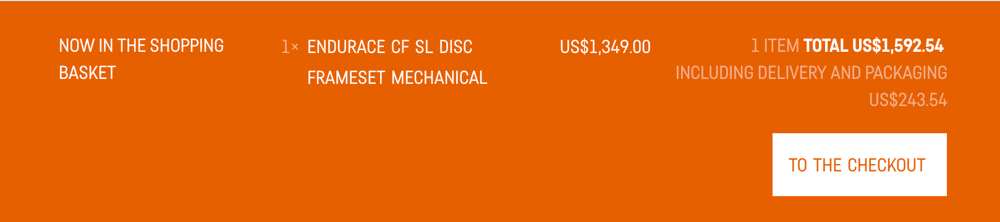
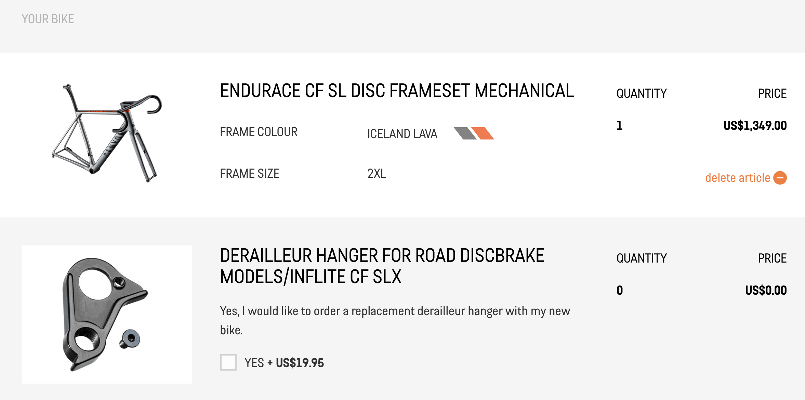
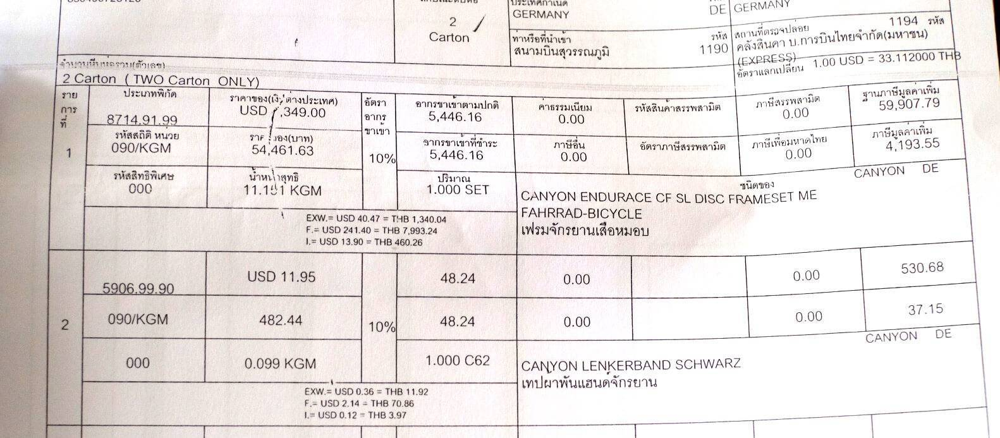

ผมสั่งซื้อจักรยานจาก Canyon เมื่อไม่กี่เดือนก่อน จึงอยากจะเขียนรีวิวขั้นตอนการสั่งซื้อจักรยานจาก canyon.com เก็บไว้ สำหรับคนที่สนใจครับ

รุ่นที่สั่งซื้อเป็นเฟรมเซ็ต Canyon Endurace CF SL รุ่นเกียร์ธรรมดา (Mechanical) เป็นเฟรม disc brake ครับ

โพสต์นี้จะขอเล่าถึงเฉพาะขั้นตอนการสั่งซื้อ แต่ขอยังไม่กล่าวถึงตัวจักรยานนะครับ ไว้ถ้ามีโอกาสจะรีวิวตัวจักรยานในตอนต่อๆ ไป

## เกริ่นนำ

Canyon เป็นแบรนด์จักรยานยักษ์ใหญ่จากประเทศเยอรมนีที่ขายจักรยานของตนเองผ่านเว็บไซต์ canyon.com เพียงช่องทางเดียว
ไม่มีตัวแทนผู้นำเข้าและผู้จำหน่ายในแต่ละประเทศเหมือนยี่ห้ออื่นๆ

หมายความว่าถ้าเราอยากได้จักรยาน Canyon ก็ต้องสั่งซื้อผ่านเว็บไซต์เท่านั้น จ่ายเงินด้วยบัตรเครดิตบนเว็บไซต์ของ Canyon เอง
แล้วจักรยานจะถูกส่งมาจากประเทศเยอรมนีตรงถึงบ้านเราเลย

ซึ่งนอกจากจะต้องจ่ายเงินค่าจักรยานแล้ว ต้องจ่ายค่าขนส่ง และภาษีนำเข้า ในอัตราที่แตกต่างกันออกไปตามแต่ละประเทศครับ (รายละเอียดจะเล่าถึงต่อไป)

ฟังดูเป็นเรื่องยุ่งยากไปหน่อยสำหรับบ้านเรา เลยมีร้านที่รับหน้าที่สั่งซื้อจักรยานจาก Canyon ให้โดยเฉพาะ คือสั่งซื้อกับทางร้าน จ่ายเงินกับทางร้าน แล้วทางร้านจะจัดการสั่งซื้อจาก Canyon ให้อีกที ที่ผมรู้จักก็มีเพจ Canyon Bike Thailand กับ JJ Canyon Bike (ไม่ได้โฆษณา)

ส่วนราคาก็แล้วแต่ร้านจะกำหนด ส่วนมากมักจะไม่ได้แพงกว่าซื้อเองเท่าไหร่ เผลอๆ บางทีอาจจะถูกกว่าด้วยซ้ำ

สรุปง่ายๆ ก็คือ ถ้าคุณอยากซื้อจักรยาน Canyon จากเมืองไทย มี 2 ทางเลือก คือ

1. สั่งซื้อเองจาก canyon.com หรือ
2. ซื้อกับร้านที่เป็นนายหน้าซื้อให้อย่างข้างบน ในกรณีที่ไม่อยากเป็นธุระซื้อเอง

ผมเลือกทางเลือกแรก: สั่งซื้อเอง เพราะอยากรู้ว่า "ประสบการณ์" การสั่งซื้อจักรยานจาก Canyon จะเป็นอย่างไร จะดีหรือไม่ดีก็จะได้รู้กันไปเลย

## 1. เลือกรุ่น ดูราคา

ขั้นตอนแรกคือเข้าไปที่เว็บ canyon.com ก่อน ถ้าเข้าจากเมืองไทยก็จะถูก redirect
ไปที่ https://www.canyon.com/en-th/ โดยอัตโนมัติ หรือไม่ก็เลือกเปลี่ยนได้จากเมนู

ราคาและสกุลเงินที่แสดงก็จะเปลี่ยนไปตามประเทศที่เลือก ราคาอาจจะแตกต่างกันเล็กน้อย
และบางประเทศก็ไม่ได้มีจำหน่ายครบทุกรุ่นครับ

สำหรับประเทศไทย จะแสดงราคาเป็นหน่วยดอลล่าห์สหรัฐ (USD) เป็นราคาที่ถูกหักภาษี EU ออกไปแล้ว เพราะเราไม่ต้องจ่ายภาษี EU แต่ต้องจ่ายเป็นภาษีนำเข้าแทนครับ (เรื่องภาษีเดี๋ยวว่ากันต่อ)

เลือกรุ่นจักรยานได้จากเมนูด้านบนเลย แบ่งรุ่นไว้ชัดเจน

พอกดเข้าไปก็ต้องเลือกรุ่นย่อยอีกที ซึ่งแต่ละรุ่นก็อาจจะมีรุ่นย่อยไม่เหมือนกัน อย่างเช่นรุ่น Endurace ที่ผมเลือก ก็จะมีรุ่นย่อยคือ

- CF SLX (คาร์บอน) รุ่นท็อป มีเฉพาะดิสก์เบรค
- CF SL (คาร์บอน) รุ่นรองท็อป มีเฉพาะดิสก์เบรคเหมือนกัน
- CF (คาร์บอน) เป็น generation ก่อนหน้ารุ่นล่าสุด มีเฉพาะริมเบรค
- AL (อะลูมีเนียม) มีทั้งดิสก์เบรคและริมเบรค

_\* แต่ละรุ่นหลักอาจจะมีรุ่นย่อยไม่เหมือนกัน และบางรุ่นย่อยอาจจะมีขายแบบ complete bike เท่านั้น ไม่มีเฉพาะเฟรมเซ็ต ต้องเช็คดูก่อนครับ_

เมื่อกดเลือกรุ่นย่อยเข้าไปแล้ว ก็จะมีหลายสเป็คและราคาให้เลือก พร้อมกับสีที่มีให้เลือกในแต่ละสเปค

รุ่นที่กำลังลดราคาจะมีป้ายส้มๆ บอกไว้ชัดเจน

กดเข้าไปดูสเป็คอย่างละเอียดได้ทุกคัน

สำหรับเฟรมเซ็ต จะมีบอกไว้ด้วยว่ามาพร้อมกับแฮนด์ / สเต็มรุ่นไหนอย่างไร อย่างเฟรม Endurace CF SL
ที่ผมเลือก มาพร้อมแฮนด์อินทิเกรต H31 กับหลักอาน S15 VCLS 2.0

ส่วนขนาดของแฮนด์ / สเต็ม จะบอกไว้ในตาราง geometry chart ครับ

### วิธีคำนวนราคา

แต่ละคันจะมีราคาบอกไว้ชัดเจนใต้รูปภาพ พร้อมทั้งระบุว่า**มีค่าใช้จ่ายเพิ่มเติมทั้งค่าบรรจุกล่องกับค่าขนส่ง**
/ ราคานี้ถูกหัก VAT. ออกแล้ว

กด link "SHIPPING" เพื่อไปดูค่าขนส่งได้ ซึ่งค่าส่งจะกำหนดไว้แน่นอน ไม่ได้ขึ้นอยู่กับว่าราคาสินค้าจะเท่าไหร่ (ค่าส่งแบบสั่งซื้อทั้งคัน (complete bike) กับแบบเฟรมเซ็ตจะไม่เท่ากัน)

ค่าส่งแพงขนาดนี้เพราะ Canyon ใช้ขนส่งด่วนเพียง 2 เจ้าเท่านั้นคือ DHL กับ UPS นั่นเอง
ผมไม่แน่ใจว่าหลักการเลือกบริษัทขนส่งของ Canyon เป็นยังไง ของผมได้มากับ UPS ครับ

ที่เราต้องจ่ายให้กับ Canyon คือ **ราคาจักรยาน + ค่าขนส่ง** ตัวอย่างเช่น

- เฟรมเซ็ต Endurace CF SL ราคาระบุไว้หน้าเว็บ $1,349
- ค่าขนส่ง $243.54
- รวมที่ต้องจ่ายตอนกดสั่งซื้อ = $1,349 + $243.54 = **$1,592.54**

เพราะฉะนั้น เวลาคำนวนราคาของรุ่นที่เล็งไว้ อย่าลืมบวกค่าขนส่งก่อน แล้วค่อยคำนวนเป็นเงินบาทครับ

## 2. สั่งซื้อและจ่ายเงิน

เมื่อตัดสินใจเลือกรุ่นที่ต้องการได้แล้ว ก็กดปุ่ม ADD TO CART จะมี pop up มาให้เราเลือกสีและไซส์รถที่ต้องการ แต่ละไซส์จะมีสถานะบอกไว้ข้างใต้

- `FROM STOCK` - มีของพร้อมส่ง
- `SOLD OUT` - ของหมด รอผลิต (ยังไม่มีกำหนด ต้องรอไปก่อน)
- (มีวันที่บอก) - กำลังอยู่ในขั้นตอนการผลิต จะพร้อมส่งตามวันที่ที่ระบุไว้

ถ้าเป็นอย่างอื่นที่ไม่ใช่ `FROM STOCK` ก็ต้องรอก่อนครับ แต่ถ้าสถานะเป็น `FROM STOCK` ก็เลือกและไปต่อได้เลย

จากนั้นก็ไปถึงหน้า Checkout จะแสดงราคาสินค้าที่เราเลือกไว้ พร้อมเสนอ option เสริมอีกมากมาย
มีทั้งสินค้าของ Canyon เอง และจากแบรนด์อื่นด้วย จะเลือกเพิ่มหรือไม่ก็แล้วแต่สะดวกเลยครับ

เท่าที่สังเกต อุปกรณ์เสริมจุกจิกของ Canyon นั้นราคาไม่แพง และบางอย่างไม่มีขายในเมืองไทย
ผมเองก็ได้ผ้าพันแฮนด์ของ Canyon ติดมาด้วย

การเลือกซื้ออุปกรณ์เสริมนั้นจะไม่เสียค่าขนส่งเพิ่มครับ

จากนั้นขั้นตอนที่ 2 ก็เป็นการใส่ที่อยู่ ไม่มีอะไรพิเศษครับ

ขั้นตอนที่ 3 เลือกวิธีการจ่ายเงิน มี 2 วิธีให้เลือกคือการโอนเงินไป กับการจ่ายด้วยบัตรเครดิต/เดบิต Visa (ผมเลือกจ่ายด้วยบัตรเดบิต Visa เพราะสะดวกดี เหมือนกับการซื้อของออนไลน์อื่นๆ)

สุดท้าย confirm order และจ่ายเงิน เป็นอันเสร็จขั้นตอนการสั่งซื้อ

เราจะได้รับ email ยืนยัน order จาก Canyon มาแบบนี้ พร้อมกับบอกว่า order ของเราจะถูกส่งออกมาช่วงวันไหน ของผมสั่งซื้อวันเสาร์กลางคืน จะถูกส่งอย่างเร็วสุดก็วันจันทร์ (วันอาทิตย์หยุด)

Canyon จะส่งใบสรุปรายการสั่งซื้อเป็น PDF แนบมาด้วย

_กรณีใช้บัตรเดบิตธนาคารกรุงเทพ: ก่อนกดซื้อแนะนำว่าควรเช็คยอดวงเงินสูงสุดต่อวันของบัตรฯ อีกครั้งครับ ของผม payment failed ไป 2-3 ครั้ง
เพราะยอดที่ต้องจ่าย (ประมาณ 52,xxx บาท ตามอัตราแลกเปลี่ยน ณ ตอนนั้น) เกินวงเงินสูงสุดต่อวันของบัตรที่ตั้งค่าไว้ (50,000 บาท) ต้องไปเปลี่ยนการตั้งค่าวงเงินของบัตรก่อน บัตรเดบิตของธ. กรุงเทพ โทรไปที่บัวหลวงโฟน 1333 ได้เลย_

### กรณีต้องการแก้ไข order

สังเกตว่าในใบสรุปการสั่งซื้อ ตรงที่อยู่จัดส่ง (delivery address) นั้นเบอร์โทรผมที่ใส่ตอนกรอกข้อมูลนั้นหายไป (ตอนก่อนกดซื้อก็เช็คแล้ว แต่ไม่รู้หายไปได้ไง)

หากต้องการเปลี่ยนแปลงข้อมูลการสั่งซื้อ เช่นชื่อ ที่อยู่ เบอร์โทรฯ หลังจากสั่งซื้อไปแล้ว
ทำได้โดยการติดต่อผ่าน contact form ในหน้าเว็บไซต์ครับ https://www.canyon.com/en-th/about-us/contact/ (หรือใครอยากจะลองโทรไป ก็ได้นะ)

ระบุ customer number ที่ได้จาก email ยืนยัน order ส่วนในช่อง message ก็บอกว่าต้องการแก้ไขอะไร
ของผมก็ขอให้เขาใส่เบอร์โทรลงไปใน delivery address ให้หน่อย เพื่อที่เวลาของมาถึงไทย บริษัท shipping จะได้โทรหาผมได้ แล้วก็มีคำถามเกี่ยวกับเรื่องการตัดวงเงินบัตรด้วย (เนื่องจากตอนแรกที่มีปัญหา payment failed)

ถ้าติดต่อในเวลาทำงานของเขา จะตอบกลับค่อนข้างไวครับ ทางโน้นก็ตอบกลับมาผ่าน email บอกว่าได้แก้ไข order ให้แล้ว พร้อมกับแนบใบยืนยัน order เวอร์ชั่นที่อัพเดทแล้วมาให้ด้วย

รออีกไม่กี่ชั่วโมง ก็ได้รับ email อีกฉบับ บอกว่าสินค้าถูกส่งมาแล้ว พร้อมทั้งเลข tracking number ของ UPS

_ของผมได้มา 2 เลขเพราะซื้อผ้าพันแฮนด์ด้วย tracking number แยกกันเพราะมีพัสดุ 2 กล่อง แต่พัสดุมาถึงพร้อมกันครับ_

## 3. ติดตาม shipping

ระหว่างนี้ก็กดติดตาม package ได้เรื่อยๆ เลย ใช้เวลาไม่ถึง 3 วัน พัสดุจากเมืองเบียร์ก็มาถึงที่สุวรรณภูมิ ถือว่าเร็วดี

## 4. ขั้นตอนการนำเข้า

มาถึงขั้นตอนสำคัญ และน่าปวดหัวที่สุดแล้ว..

เนื่องจากเป็นสินค้าที่ต้องเสียภาษีนำเข้า ก็จะมีขั้นตอนคร่าวๆ ดังนี้ครับ

1. สินค้ามาถึงเมืองไทย
2. ศุลกากรตรวจสอบ คำนวนภาษีที่เราต้องจ่ายเพิ่ม (ในระหว่างนี้ศุลกากรจะกักของไว้ก่อน)
3. บริษัท shipping แจ้งเรามาว่าต้องเสียภาษีเพิ่มอีกเท่าไหร่
4. เราจ่ายภาษีตามที่แจ้ง
5. บริษัท shipping เข้าไปรับของจากศุลกากร แล้วส่งให้เราตามที่อยู่

แต่ในความเป็นจริงมีรายละเอียดยิบย่อยค่อนข้างเยอะ สำหรับมือใหม่จะงงได้ง่ายๆ จะพยายามเขียนให้ละเอียดที่สุด หากบกพร่อง หรือผิดพลาดตรงไหนรบกวนคอมเม้นต์แจ้งไว้เลยครับ

---

เริ่มจากคำถามที่มักจะถามกันบ่อยๆ ก่อน

### ต้องเสียภาษีไหม?

ตามหลักแล้วขึ้นอยู่กับดุลยพินิจของศุลกากร ว่าจะเรียกเก็บภาษีกับสินค้าของเราไหม ถ้าเป็นสินค้าราคาไม่สูงมากอาจจะไม่ถูกเรียกเก็บภาษีก็ได้ สำหรับสินค้าจักรยาน
ลองไปอ่านกระทู้นี้จาก ThaiMTB ดูได้ครับ: [รีวิว เว็ป E-Commerce สินค้าเกี่ยวกับจักรยาน ที่ส่งมาไทย](http://www.thaimtb.com/forum/viewtopic.php?f=60&t=1740855)
ในคอมเม้นต์มีทั้งบอกว่าโดนเก็บภาษีและไม่โดน

แต่สินค้าราคาสูงอย่างจักรยานหรือเฟรมจักรยาน พร้อมกับส่งมาทางบริษัทเอกชนอย่าง DHL หรือ UPS แบบนี้ คิดว่าโดนเรียกเก็บภาษีแน่นอนครับ

### ต้องเสียภาษีเท่าไหร่

ศุลกากรจะเรียกเก็บภาษี 2 แบบครับ

* ภาษีนำเข้า - พิกัดภาษีขึ้นอยู่กับชนิดสินค้า ถ้าเป็นจักรยานทั้งคัน (complete bike) พิกัดภาษีอยู่ที่ 30% แต่ถ้าเป็นชิ้นส่วนจักรยานหรืออะไหล่ จะอยู่ที่ 10% เฟรมจักรยานถือเป็นชิ้นส่วนจักรยาน เสียภาษีนำเข้า 10%
* ภาษีมูลค่าเพิ่ม (VAT.) อีก 7%

#### คิดยังไง

- ภาษีนำเข้าจะถูกคำนวน**ต่อสินค้าแต่ละชิ้น** ราคาที่นำมาคำนวนภาษีคือ **ราคาสินค้าต่อชิ้น** ส่วนค่าขนส่งสินค้า แต่ที่อ่านมาในเน็ตบ้างก็ว่าจะถูกนำไปคิดภาษีรวมกับราคาสินค้าด้วย บ้างก็ว่าไม่รวม ของผมค่าขนส่ง**ไม่ถูกนำไปรวมคิดภาษี**ครับ
- ราคาสินค้าจะถูกแปลงเป็นสกุลเงินบาทก่อน แล้วค่อยนำไปคำนวนภาษี
- ภาษีมูลค่าเพิ่ม (VAT.) 7% จะถูกคิด**จากราคาสินค้า + ภาษีนำเข้า**อีกที

ตัวอย่างในกรณีของผม

- เฟรมจักรยาน ราคา $1,349 แปลงเป็นเงินบาทได้ **54,461.63 บาท** (อัตราแลกเปลี่ยน ณ เวลานั้น)
- ภาษีนำเข้า 10%: = **5,446.16 บาท**
- รวมกับราคาสินค้า เป็น **59,907.79 บาท** ส่วนนี้เรียกว่า _ฐานภาษีมูลค่าเพิ่ม_
- จากนั้นคิดภาษีมูลค่าเพิ่ม 7% เข้าไปอีก: `59,907.79 * 7%` เป็น **4,193.55 บาท**
- รวมคร่าวๆ ภาษีที่ต้องจ่ายคือ 5,4xx + 4,2xx ~ ประมาณ 9,600 บาท

เป็นภาษาพูดง่ายๆ คือ ราคาของ 5 หมื่นนิดๆ ต้องจ่ายภาษีอีกเกือบหมื่น

ยังไม่หมด: เนื่องจากภาษีจะถูกคิดต่อสินค้าแต่ละชิ้น ผ้าพันแฮนด์ ​Canyon ของผมก็ถูกคิดภาษีเหมือนกัน!
เฉพาะผ้าพันแฮนด์ (ที่ราคา 4 ร้อยกว่าบาท) โดนเรียกเก็บภาษีอีกประมาณ 85 บาท

สังเกตว่าไม่ได้คิดทีเดียว 17% นะครับ แต่คิดภาษีนำเข้า 10% ก่อน รวมกับราคาสินค้าแล้วได้เท่าไหร่
ค่อยนำยอดนั้นมาคิด VAT 7% อีกที ส่วนอัตราแลกเปลี่ยนนั้นดูจากวันที่ถูกคิดภาษี ไม่ใช่วันที่เราซื้อสินค้าครับ

ก็เป็นเงินไม่น้อยอยู่เหมือนกัน

#### มีค่าใช้จ่ายอื่นๆ อีกไหม

แน่นอน.

---

_**คำเตือน**: เนื้อหาที่จะได้อ่านต่อไปนี้คือประสบการณ์ตรงของผมเอง ไม่อาจใช้อ้างอิงว่าเป็นข้อเท็จจริง และไม่รับประกันว่าคนอื่นจะได้รับประสบการณ์แบบเดียวกัน
โปรดใช้วิจารณญาน_

หลังจากที่สินค้ามาถึงเมืองไทยแล้ว UPS Thailand โทรมาตามเบอร์ที่ผมให้ไว้ใน shipping address แจ้งว่ามีสินค้ามาส่ง พร้อมกับขอ email ผมไปเพื่อส่งข้อมูลเพิ่มเติม (ในใบขนส่งสินค้าทางอากาศที่ติดมากับสินค้า Canyon ไม่ได้ใส่ email มาด้วย)

รอสักพักก็ได้ email มาจาก UPS Thailand มาพร้อมรายละเอียด ที่อ่านแล้วให้ความรู้สึกว่า...

