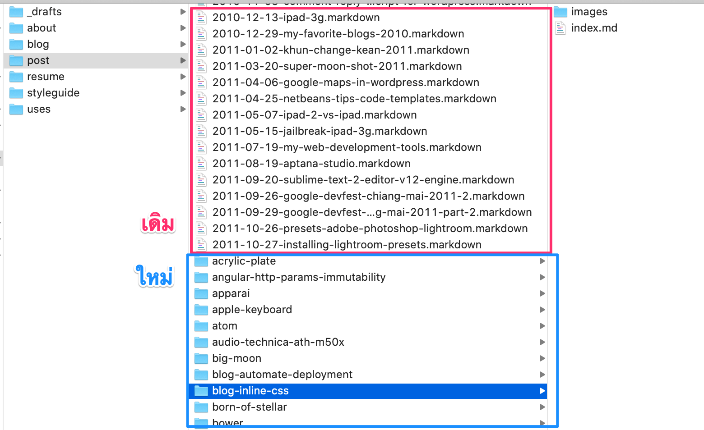

บล็อกนี้ทำด้วย Hugo เก็บ content ที่เป็นโพสต์ต่างๆ ไว้ในโฟลเดอร์ `content/post/`
ซึ่งแต่ละโพสต์ก็จะอยู่ในโฟลเดอร์ของตัวเองอีกที เช่น `content/post/ten-years/index.md`
เพื่อให้แต่ละโฟลเดอร์เป็น [1 page bundle](https://armno.in.th/2019/07/25/hugo-image-resize/#page-bundle)
ตาม concept ใน Hugo

แต่ยังมีโพสต์เก่าๆ ที่ยังไม่ได้อยู่ในโฟลเดอร์ของตัวเอง หลงเหลืออยู่
เป็นโพสต์ที่[ย้ายมาจากบล็อก Jekyll](https://armno.in.th/2018/03/24/jekyll-to-hugo/) เมื่อก่อนนู้น

ชื่อไฟล์จะอยู่ในรูปแบบ `YYYY-MM-DD-post-slug.markdown`
ซึ่ง Hugo ก็อ่านได้ปกติ เพราะเป็น content ที่เป็นไฟล์ markdown เหมือนกัน
เพียงแต่มันดูรกไปหน่อย

อยากจัดระเบียบให้มันหน่อย

## ภารกิจ

ภารกิจของผมคือ ย้ายไฟล์ชื่อ (ตัวอย่าง) `2011-03-29-hello-world.markdown` ไป `hello-world/index.md`
ซึ่งมีไฟล์ต้องย้ายอยู่ 140 กว่าไฟล์

ผมมีความคิดจะเขียน shell script ขึ้นมาเพื่อ automate process นี้
ถึงแม้ว่าเขียน shell script ไม่เป็น แต่มีความขี้เกียจเป็นทุน
ก็เลยใช้โอกาสนี้ในการทบทวน

### วางแผน

1. loop ไฟล์ `.markdown` ทั้งหมดในโฟลเดอร์ `content/post/`
2. ตัดส่วนวันที่ออกจากชื่อไฟล์ `20xx-xx-xx-`
3. ตัดส่วน extension `.markdown` ออกจากชื่อไฟล์
4. ก็จะเหลือ post slug ตรงกลาง สร้างโฟลเดอร์ใหม่จากชื่อนี้
5. ย้ายไฟล์ `.markdown` ไปเป็น `index.md` ในโฟลเดอร์ที่สร้างใหม่
