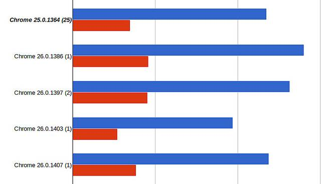
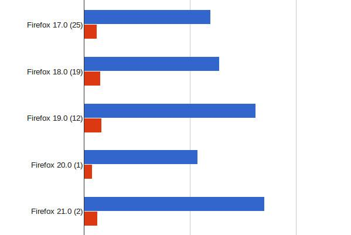

---
categories:
  - Web Development
comments: true
date: 2012-03-26T23:09:42Z
description:
  เราสามารถใช้ querySelector() และ querySelectorAll() สำหรับ query DOM
  element โดยใช้ CSS selector ได้อย่างสะดวกใจ คล้าย selector ของ jQuery ครับ
slug: queryselector-queryselectorall-selectors-api
keywords:
  - HTML5
  - JavaScript
  - Selectors API
  - Web Development
title: querySelector() และ querySelectorAll() Selectors API
url: /2012/03/26/queryselector-queryselectorall-selectors-api/
---

ปกติ [DOM](http://www.w3.org/DOM/) _(Document Object Model)_ มี API method สำหรับการหา element จาก ID และจากชื่อ class อยู่แล้ว ตัวอย่างเช่น มี HTML แบบนี้



  Aloha! Welcome to Panda Empire!



เราจากสามารถหา element p ได้จาก ID โดย


var p = document.getElementById('welcome');


หรือหาจากชื่อ class


var p = document.getElementsByClassName('message')[0];


แต่ใน HTML5 มี **Selectors API** เกิดขึ้นมาทำให้เราสามารถใช้ CSS selector ในการหา element ได้ง่ายๆ เลย (อารมณ์เดียวกับ selector ใน jQuery) โดยใช้ method `querySelector()` หรือ `querySelectorAll()`

จากตัวอย่างข้างบน เราสามารถเขียนใหม่โดยใช้ Selectors API ได้เป็น


var p = document.querySelector('#welcome');


หรือ


var p = document.querySelector('.message');


หรือ


var p = document.querySelectorAll('.message')[0];


ข้อสังเกตคือ parameter ที่เราส่งให้ `querySelector()` และ `querySelectorAll()` นั้นเป็น string ที่เป็น CSS Selector ต่างจากเดิมที่ใช้ชื่อ ID และ class

ส่วนความแตกต่างระหว่าง `querySelector()` และ `querySelectorAll()` คือ `querySelector()` จะ return ค่าเป็น Node แรกที่เจอใน document ส่วน `querySelectorAll()` นั้น return ค่าเป็น NodeList คล้ายๆ array ของ Node ทั้งหมดใน document ที่ตรงตามที่ระบุใน selector

สามารถใช้ CSS selector ที่ซับซ้อนๆ (รวมไปถึง CSS3 selector) เป็น parameter ในการ query DOM ได้ในครั้งเดียว เช่น


var el = document.querySelector('.navigation li > a#current');


เปลี่ยน scope ของการ query DOM นอกเหนือจาก document element ก็ได้


var ul = document.querySelector('#adminmenu');
var li = ul.querySelectorAll('li');


chain ก็ยังได้


var li = document.querySelector('#adminmenu').querySelectorAll('li');


### Performance

มี [test บน jsperf.com](http://jsperf.com/getelementbyid-vs-queryselector) นั้นบอกว่า `getElementById()` เร็วกว่า `querySelector()` อยู่ค่อนข้างเยอะครับ (หลายเท่าตัว) (แต่ผมว่าเอาเข้าจริงๆ การใช้งานทั่วไปคงไม่มีใครเห็นความแตกต่าง) แต่ถ้าัสังเกตกราฟของ Google Chrome รวมถึง Webkit ในเวอร์ชั่นหลังๆ มานี้ จำนวน opt/sec ของ `querySelector` นั้นก็เพิ่มขึ้นเยอะอยู่เหมือนกัน

ดูหลายๆ test case ได้จากแต่ละ revision ใน jsperf เปรียบเทียบกันดูได้

### ความเห็นส่วนตัว

ผมเลือกใช้ Selectors API มากกว่า DOM API เพราะ

1. ใช้ CSS Selector จำง่าย คล้าย jQuery
2. ไม่ว่าจะหาจาก ID หรือ class ก็ใช้ method เดียวกันได้
3. ประหยัดเวลาเขียน code ไม่ต้อง query DOM หลายๆ ครั้ง (chain)
4. ใช้งานได้กับ browser รุ่นใหม่ทั่วไป (ได้ถึง IE8) ส่วน `getElementsByClassName()` นั้นต้อง IE9 ขึ้นไป (แต่ IE8 จะใช้ CSS3 selector ไม่ได้นะ)

ส่วนใครจะใช้แบบไหน ก็แล้วแต่ถนัด แล้วแต่ว่าจะรองรับ browser เก่าๆ ด้วยหรือเปล่า ถ้าต้องทำให้รองรับตั้งแต่ IE6 แล้วล่ะก็ Selectors API ก็อาจจะไม่ใช่คำตอบครับ เพราะ 2 method นี้ ใช้กับ IE6 IE7 ไม่ได้เด้อ

อ่านรายละเอียดเพิ่มเติม เกี่ยวกับ Selectors API ได้ที่

- [querySelector](https://developer.mozilla.org/En/DOM/Document.querySelector) และ [querySelectorAll](https://developer.mozilla.org/en/DOM/document.querySelectorAll) จาก MDN
- [Selectors API Specifications](http://www.w3.org/TR/selectors-api/) จาก W3
- [Can I use](http://caniuse.com/#search=querySelector) ดูการ support ของแต่ละ browser
