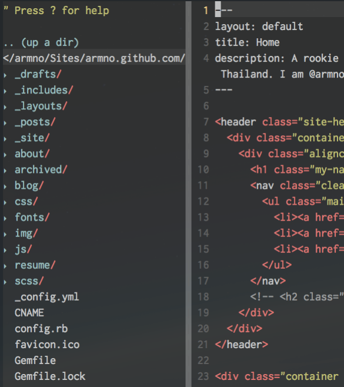
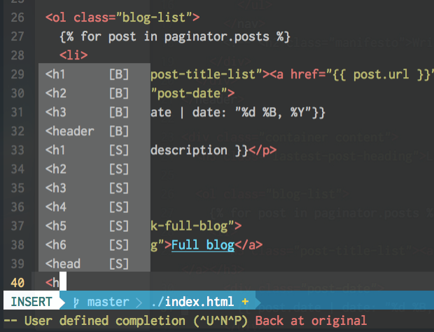
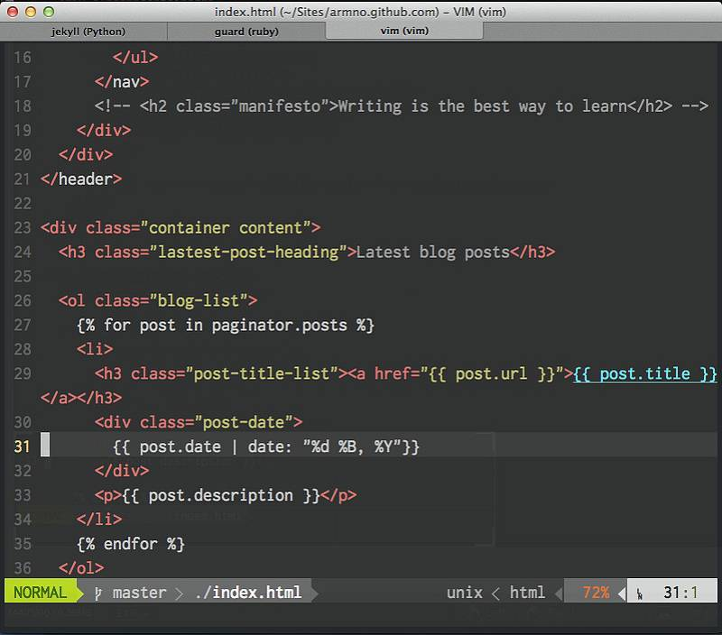
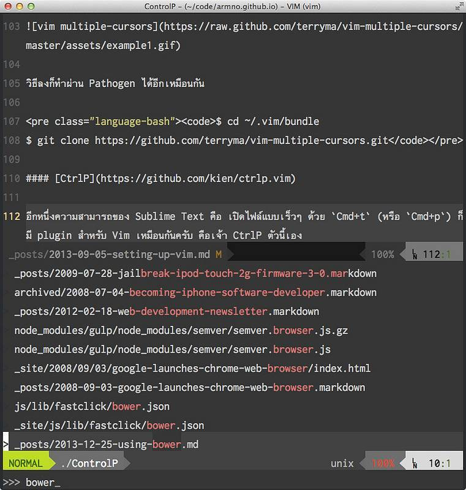

ปกติผมใช้ [Sublime Text 3](http://armno.in.th/2013/07/08/setting-up-sublime-text-3/) เป็น code editor ตัวหลัก แต่บางครั้งต้องการแก้ไขไฟล์ง่ายๆ เร็วๆ จาก terminal หรือทำโปรเจ็คเล็กๆ (เขียนโค้ดตาม tutorial ในเว็บต่างๆ) ผมก็จะเลือกใช้ Vim แทน เพราะเร็วกว่าเปิดใน Sublime Text ครับ

[Vim](http://www.vim.org/) นั้นเป็น editor ที่เราสามารถปรับแต่งได้ค่อนข้างหลากหลายไปตามความชอบและความถนัดของแต่ละคน โพสต์นี้ผมก็ขอแชร์วิธี set up Vim ของผมเองบ้างครับ

<blockquote>
ใช้ได้ทั้ง Ubuntu (13.04) กับ Mac OSX (10.8) เวอร์ชั่นต่ำกว่านี้อาจได้เหมือนกัน แต่ผมไม่ได้ลองเองครับ
</blockquote>

<blockquote>
บน OSX นั้น ผมใช้ homebrew เป็นหลัก สามารถดูวิธีติดตั้งได้จาก <a href="http://brew.sh">brew.sh</a> ครับ (ง่ายมาก)
</blockquote>

### ติดตั้ง Vim

บน OSX นั้นมี Vim ติดมาแล้ว แต่ผมติดตั้งจาก homebrew ใหม่อีกที เพื่อให้ง่ายต่อการอัพเดท ส่วนบน Ubuntu นั้นลงผ่าน `apt-get` ได้เลยครับ

OSX


$ brew install vim


Ubuntu


$ sudo apt-get install vim


แค่นี้เราสามารถใช้ command `vim` ได้จาก terminal แล้วครับ

### `.vimrc`

ไฟล์ `.vimrc` เป็นไฟล์เก็บค่า config ต่างๆ ของ Vim ถูกเก็บอยู่ที่ home directory ของเรานั่นเอง (`~/.vimrc`) ถ้าหากติดตั้ง Vim แล้วยังไม่มีไฟล์นี้ เราก็สามารถสร้างขึ้นมาใหม่ได้นะครับ

สำหรับไฟล์ `.vimrc` ของผม ก็หน้าตาประมาณนี้ครับ ส่วนมากก็ลอกมาจากหลายๆ ที่ครับ ส่วนที่สองนั้นเป็น color scheme ชื่อว่า railscasts ซึ่งผมไม่ได้หรอกครับ (อ้าว?) เอาเก็บไว้ด้วยกัน กันหาย ส่วน colorscheme ที่ผมใช้จริงๆ ชื่อว่า [Tomorrow Night](https://github.com/chriskempson/tomorrow-theme) ครับ

### Plugins

#### [Pathogen](https://github.com/tpope/vim-pathogen)

อันดับแรกต้องลง **Vim-pathogen** ก่อน เป็น plugin ที่ทำให้ลง plugin ตัวอื่นๆ ได้ง่ายขึ้นครับ วิธีลงก็แค่ copy 3 บรรทัดนี้ไปรันใน terminal ได้เลย


mkdir -p ~/.vim/autoload ~/.vim/bundle; \
curl -Sso ~/.vim/autoload/pathogen.vim \
https://raw.github.com/tpope/vim-pathogen/master/autoload/pathogen.vim


#### [NERDTree](https://github.com/scrooloose/nerdtree)

NERDTree เป็น file explorer ของ Vim ครับ ใช้เป็น sidebar คล้ายๆ ของ Sublime Text ได้ ติดตั้ง plugin ตัวนี้ได้ผ่าน Pathogen ครับ


$ cd ~/.vim/bundle
$ git clone https://github.com/scrooloose/nerdtree.git


#### [Emmet](http://mattn.github.io/emmet-vim/)

Emmet (ชื่อเดิมคือ [Zen Coding](https://armno.in.th/2012/11/06/emmet-zen-coding-replacement/)) นั้นเป็น plugin ที่ช่วยให้เขียน HTML ได้เร็วขึ้นครับ จริงๆ แล้วผมไม่ค่อยได้ใช้ Emmet ใน Vim แต่ลงไว้ก็ไม่เสียหายครับ สามารถติดตั้งผ่าน Pathogen อีกเหมือนกัน


$ cd ~/.vim/bundle
$ git clone http://github.com/mattn/emmet-vim.git


ปกติคีย์สำหรับใช้งาน Emmet คือ `Ctrl+Y+,` ผมว่าสูตรนี้มันกดติดยากไปหน่อย เซ็ต key mapping ใน `.vimrc` ให้เป็น `,t` แทน (ผม map ตัว `,` แทน `<leader>`)


map <leader>t <C-y>,


#### [Autoclose](https://github.com/Townk/vim-autoclose)

ช่วยปิดพวกวงเล็บ วงเล็บปีกกาให้อัตโนมัติครับ ตัวนี้ติดตั้งผ่าน Pathogen ไม่ได้ ต้องดาวน์โหลดไฟล์มาเองครับ


$ wget --no-check-certificate https://raw.github.com/Townk/vim-autoclose/master/plugin/AutoClose.vim -O ~/.vim/plugin/AutoClose.vim
$ wget --no-check-certificate https://raw.github.com/Townk/vim-autoclose/master/doc/AutoClose.txt -O ~/.vim/doc/AutoClose.txt


#### [neocomplcache](https://github.com/Shougo/neocomplcache.vim)

เป็น auto complete ของ Vim ที่ผมใช้อยู่ครับ ทำงานได้ค่อนข้างดีเลยทีเดียว การติดตั้งนั้นทำได้โดยดาวน์โหลดไฟล์เป็น .zip จาก Github repo แล้ว extract ไฟล์ทั้งหมดไปที่โฟลเดอร์ `~/.vim` ครับ


$ wget --no-check-certificate https://github.com/Shougo/neocomplcache.vim/archive/master.zip -O - | unzip ~/.vim/


แต่บน OSX 10.8 นั้นเจอปัญหาบ้างคือ บางครั้ง neocomplcache ทำให้มี delay ตอนสลับไปมาระหว่าง command mode กับ insert mode ครับ (ประมาณ 1 วินาที)

#### [Powerline](https://github.com/Lokaltog/powerline)

ทำให้ status bar ของ Vim นั้นมีประโยชน์และน่าสนใจขึ้นมาอีกหน่อย วิธีติดตั้งดูได้จาก [documentation](https://powerline.readthedocs.org/en/latest/overview.html#installation) บนเว็บของ Powerline ได้เลย คอนข้างยาวและยุ่งครับ

Powerline ใน terminal จะไม่มีสีพื้นหลัง ถ้าไม่ได้เซ็ต terminal color mode ให้เป็น 256 สี วิธีเซ็ตก็คือเพิ่ม `set t_Co=256` ในไฟล์ `.vimrc` (ผมเองเปิดบ้างปิดบ้าง ไม่มีพื้นหลังมันก็เรียบๆ สวยดีนะ)

Vim ของผมก็ประมาณนี้ครับ ยังใช้ไม่คล่องแต่ก็พยายามฝึกใช้อยู่ ใครมีเทคนิคอะไรเกี่ยวกับ Vim ก็เอามาแบ่งปันกันได้นะ :)

_Updated 2014.02.04_

#### [vim-multiple-cursors](https://github.com/terryma/vim-multiple-cursors)

plugin ตัวเทพนี้ทำให้ Vim มี mulitple cursors ได้เหมือน Sublime Text ครับ (ขออนุญาตยืมรูปมาจากเจ้าของ plugin) สามารถกด `Ctrl+n` เพื่อเลือกคำที่เหมือนกันได้ คล้ายๆ `Cmd+d` ใน Sublime Text ครับ

วิธีลงก็ทำผ่าน Pathogen ได้อีกเหมือนกัน


$ cd ~/.vim/bundle
$ git clone https://github.com/terryma/vim-multiple-cursors.git


#### [CtrlP](https://github.com/kien/ctrlp.vim)

อีกหนึ่งความสามารถของ Sublime Text คือ เปิดไฟล์แบบเร็วๆ ด้วย `Cmd+t` (หรือ `Cmd+p`) ก็มี plugin สำหรับ Vim เหมือนกันครับ คือเจ้า CtrlP ตัวนี้เอง อย่างในรูปผมลองหา bower ใน repo นี้ ก็จะเจอไฟล์ตามข้างล่าง ความเร็วในการหานั้นพอๆ กับ Sublime Text เลยทีเดียว เพียงแต่มันกลับด้านกันเท่านั้น

ใช้งานผ่าน Pathogen ได้อีกแล้วจ้า


$ cd ~/.vim/bundle
$git clone https://github.com/kien/ctrlp.vim.git


หลังจากลงแล้วก็ทำให้ใช้งานสะดวกขึ้น โดยเซ็ต key binding ให้เป็น `Ctrl+p` (ตามชื่อ) ได้ โดยเพิ่มในไฟล์ `.zshrc` ครับ


let g:ctrlp_map = '<c-p>'
let g:ctrlp_cmd = 'CtrlP'


ตอนนี้ Vim ก็คล้าย Sublime Text ขึ้นมาอีกหน่อย :)

Update: เขียนตอน 2 แล้วครับ ตามไปอ่านได้ที่ [Setting Vim: Part II](https://armno.in.th/2015/02/26/setting-up-vim-part-2/)
