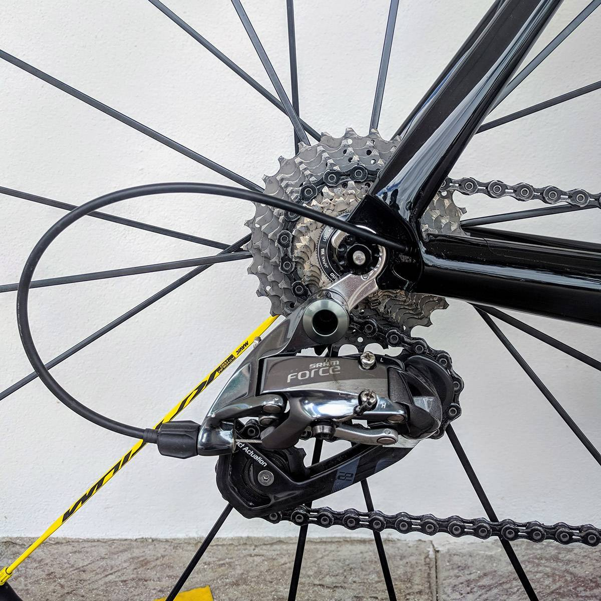

ปั่นจักรยานเสือบหมอบมาได้ประมาณ 2 ปี เพิ่งมีโอกาสได้เปลี่ยนจักรยานเสือหมอบ จากเฟรมอลูมิเนียมเป็นเฟรมคาร์บอนกับเขาบ้าง เฟรมที่เลือกเป็น [Storck Visioner Comp G1](https://www.storckworld.com/en/bike-finder/bike/visioner-comp-g1/)
รุ่นปี 2017 สีดำเงา มีโอกาสได้ถ่ายรูปเก็บไว้นิดหน่อยครับ

ผมปั่นจักรยานเพื่อออกกำลังกายและท่องเที่ยว เน้นปั่นขึ้นเขาเป็นหลัก โชคดีที่บ้านกับที่ทำงานอยู่ใกล้ดอยสุเทพ เลยได้ปั่นขึ้นดอยสุเทพเป็นเส้นทางประจำครับ

จักรยานที่ใช้ก่อนหน้านี้คือ Trek Émonda ALR 5 รุ่นปี 2016 เป็นจักรยานอลูมิเนียมที่ขี่ดีครับ น้ำหนักเฟรมค่อนข้างเบา ทำให้ปั่นขึ้นเขาได้สนุกดี

  

พอคิดว่าหาแนวทางของตัวเองเจอ และด้วยความที่ชอบปั่นขึ้นดอย ผมจึงตั้งเป้ากับตัวเองไว้ว่า ถ้าปั่นขึ้นดอยเก็บ
[elevation gain](https://www.strava.com/athletes/3637623) (ความชันสะสม)
ได้ครบ 100,000 เมตรเมื่อไหร่ถึงค่อยเปลี่ยนเป็นเฟรมคาร์บอนไฟเบอร์่่
แต่เอาเข้าจริงก็เลยไปถึง 140,000 เมตรเพราะว่าเก็บเงินไม่ทันครับ 😅

ในระหว่างนั้นก็ดูข้อมูลเฟรมที่เล็งๆ ไว้หลายๆ รุ่น ตั้งงบไว้ที่ 40,000 ถึง 60,000 บาท แนวที่อยากได้เป็นเฟรมแนว "ไต่เขา" หรือ All Round
โดยที่เน้นการตอบสนองแรง น้ำหนักเบา และไม่ได้ให้ความสำคัญกับเรื่อง aerodynamics เท่าไหร่

เฟรมในฝันของผมคือ [Canyon Ultimate CF SLX](https://www.canyon.com/en/road/ultimate/f-ultimate-cf-slx-mechanical.html) แต่พอรวมราคาเฟรม ค่าส่ง ภาษีนำเข้า มันเกินงบไปเยอะ ก็เลยตัดไป
ส่วนรุ่นอื่นที่เล็งไว้ก็มี [Lapierre Xelius SL](https://shop.lapierrebikes.com/xelius-sl-600-fdj-2017), [Nich Faith](https://www.nichcycling.com/pages/nich-faith) หรือแม้แต่ [Trek Émonda SL](https://www.trekbikes.com/us/en_US/bikes/road-bikes/performance-road/émonda/émonda-sl-frameset/p/17498/) ก็ดูไว้ด้วย

สุดท้ายเลือก [Storck Visioner](http://www.storckworld.com/en/bike-finder/bike/visioner-comp-g1/)
เฟรม all round รุ่น "เริ่มต้น" ของแบรนด์ Storck
ซึ่งเมื่อเทียบสเป็คกับรุ่นอื่นแล้วอาจจะดูด้อยกว่าด้วยน้ำหนักที่เยอะ และราคาค่อนข้างสูง แต่ได้อ่านเรื่องราวของลุง Marcus Storck (ผู้ก่อตั้งและเจ้าของ) และเรื่องราวของจักรยาน Storck เอง ก็รู้สึกชอบขึ้นมา
อาจเป็นเพราะ Storck เป็นแบรนด์จากประเทศเยอรมนีด้วย ผมเลยมี bias หน่อยๆ
_([บริษัทที่ผมทำงานอยู่](https://www.buzzwoo.de) เป็นบริษัทจากประเทศเยอรมนี)_

ส่วนเรื่องประสิทธิภาพนั้น สำนักรีวิวหลายๆ เจ้าก็ให้คะแนนออกมาค่อนข้างดี ก็เลยไม่ค่อยกังวลเท่าไหร่
สุดท้ายใช้อารมณ์ช่วยตัดสินใจด้วย เลยได้มาปั่นแบบมึนๆ

  

Storck Visioner เป็นจักรยานเสือหมอบในกลุ่ม All Round ในระดับเริ่มต้นของแบรนด์ Storck
รุ่นปัจจุบันมีอยู่ 2 สีคือสีดำ กับสีขาวตัดกับชมพู-ม่วง ในชื่อ [Storck Visioner Prana](http://www.storckworld.com/bike-finder/bike/visioner-prana-g1/) ซึ่งน่าจะเน้นตลาดนักปั่นหญิงมากกว่าครับ

โพสต์นี้อยากจะแนะนำส่วนประกอบต่างๆ พร้อมความรู้สึกจากการปั่นของตัวผมเอง ส่วนข้อมูลทางเทคนิค และรีวิวแบบละเอียดนั้นอ่านจาก
[DuckingTiger รีวิว: Storck Visioner C G2](https://www.duckingtiger.com/storck-visioner-c-g2-review/)
ได้ครับ (แนะนำ) เฟรมเดียวกันแต่เป็นรุ่นของปีก่อนหน้า

## สเป็ค

ข้างล่างนี้เป็นสเป็คปัจจุบัน อาจจะต่างกับในรูปที่เคยถ่ายไว้นิดหน่อย ไม่ได้ถ่ายทุกรูปในช่วงเวลาเดียวกันครับ

- เฟรม: Storck Visioner Comp G1
- ชุดขับ: SRAM Force 22s + เฟือง Dura-Ace 9100 11-28T
- ล้อ: Mavic Ksyrium Pro (รุ่นปี 2016)
- โซ่: KMC X11SL
- เบรค: EE Cycleworks Single Mount
- แฮนด์: Easton EC90 SLX (รุ่นปี 2014)
- สเต็ม: Uno 7 Series 90mm Aluminum
- หลักอาน: KCNC Ti Pro Lite 31.6mm
- เบาะ: SQLab Ergowave 612 Active, S-Tube
- บันได: Shimano Dura-Ace R9100
- น้ำหนัก: ประมาณ 7.25kg (รวมบันได)

### เฟรม: Storck Visioner Comp G1 (55cm)

เฟรมสีดำเงา ไซส์ 55 (ผมสูง 180cm) ดีไซน์เรียบๆ แทบจะไม่มีลวดลาย หรือสรรพคุณอะไรเลย
(ไม่มีโลโก้ UCI ด้วย) ดูจากด้านข้างแล้วจะดูอวบๆ ตันๆ

ตามสเป็ค เฟรมหนัก 1,250g ซึ่งหนักกว่าเฟรม Émonda ALR อยู่ประมาณ 200g
(เฟรม ALR หนัก 1,050g)
ทำให้ประกอบรถออกมาแล้วหนักกว่าเดิมประมาณ 300g
ความจริงข้อนี้ไม่ค่อยมีใครเชื่อเท่าไหร่
หลายคนไม่เข้าใจว่าทำไมจ่ายแพงกว่า แต่ได้รถที่หนักกว่าเดิม
แต่จริงๆ แล้ว รถที่เบากว่า ไม่ได้หมายความว่าจะดีกว่าเสมอไปนะ

  

งานสีและเคลือบเงาเนียนมาก ซึ่งก่อนหน้านี้ผมชอบเฟรมสีดำด้านแบบ Émonda ของเดิม แต่ว่าได้สีเงามาก็สวยไปอีกแบบ แถมเช็ดง่ายกว่าเฟรมสีด้านเยอะเลย

  

ตะเกียบคาร์บอน Stiletto ตามสเป็คหนัก 340 กรัม ซับแรงสะเทือนช่วงหน้ารถได้ดีมาก
รู้สึกนิ่ง และรู้สึกสะท้านมือน้อยกว่าตะเกียบของ Émonda ALR

  

เทียบจากตารางหาค่า trail จากค่า head tube angle กับ fork rake จากเว็บ [bikeraceinfo](http://www.bikeraceinfo.com/tech/trail.html) แล้ว
ตะเกียบ Stiletto ของ Visioner ให้ระยะ trail ที่มากกว่าตะเกียบของ Émonda ALR เล็กน้อย
_(Visioner 6.11cm, Émonda ALR 5.69cm)_

ซึ่งตามทฤษฎีแล้ว รถที่มีระยะ trail มากขึ้น จะทำให้รู้สึกว่าการบังคับควบคุมช่วงหน้ารถจะหนักแน่นกว่า และรู้สึกมั่นคงมากกว่า
แต่บ้างก็ว่าเป็นความรู้สึกที่ "ช้า" ลง (more stable, less twitchy)

  

(มีเว็บคำนวนค่า trail จากค่า head tube angle กับ fork rake (offset) ที่
[Bicycle Trail Calculator](http://yojimg.net/bike/web_tools/trailcalc.php))

จุดเด่นอีกอย่างของเฟรม Storck Visioner คือระยะ chainstay length ที่สั้นเพียง 399mm
เวลาเข้าโค้งที่เราจะใช้การเอียงตัว และแรงถ่วงจากด้านหลังของตัวรถ
ทำให้ช่วงล่าง-ช่วงหลังของ Visioner ให้ความรู้สึก "ไว" กว่า - ใช้แรง _น้อยกว่า_ ในการเอียงตัวและถ่วงน้ำหนักในการเข้าโค้ง

  

พอรวมจุดเด่นจากระยะ trail ยาว และ chainstay length สั้น
นั้นเข้ากันได้พอดี ทำให้ได้ฟิลลิ่งการบังคับรถที่สนุกมาก บังคับควบคุมได้ว่องไว โดยที่ยังรู้สึกหนักแน่นมั่นคง และให้ฟีลเกาะถนนได้ดี

### ชุดขับ: SRAM Force 22s (GXP)

จริงๆ ชุดเกียร์เดิมที่ติดมากับ Émonda ALR คือ Shimano 105
แต่วันหนึ่งด้วยความสงสัยว่าระบบ Double Tap ของ SRAM มันเป็นยังไง
เลยเปลี่ยนชุดเกียร์ทั้งชุด ย้ายค่ายจาก Shimano มาเป็น SRAM

เรื่องชุดเกียร์นี่ผมมองว่านอกจากประสิทธิภาพแล้ว ความชอบส่วนตัวก็ผลก็การตัดสินใจเลือกด้วยครับ
พอลองใช้งานจริงแล้ว ผมชอบ feedback ของการเปลี่ยนเกียร์ของ SRAM มากกว่า

แต่ก็ใช่ว่าจะไม่มีข้อเสียครับ ชุดเกียร์ของ SRAM ถ้าเซ็ตไว้ดีก็จะทำงานได้ดีมาก
แต่ถ้าผิดไปนิดเดียวก็อาจจะเจอปัญหาจุกจิกได้บ้าง ที่ผมเจอบ่อยก็มีโซ่ตกที่จานหน้า
กับเกียร์กระโดดที่ตีนผีด้านหลัง ปัญหาพวกนี้ถ้าได้ช่างตั้งเกียร์ให้ดีๆ ก็ไม่น่าจะใช่เรื่องใหญ่อะไร

  

เฟืองที่ติดมากับชุดขับเป็นเฟือง 11-32T เน้นขึ้นดอยเป็นหลัก
แต่เนื่องจากเส้นทางประจำที่ผมปั่น ไม่ค่อยได้ใช้เฟือง 32T บ่อยเท่าไหร่นัก (เป็นเฟืองเฉพาะกิจ)
เลยเปลี่ยนมาเป็น Dura-Ace 9100 11-28T
ที่ไม่ได้เลือกเฟือง Red เพราะช่างบอกว่าปัญหาเยอะ
แถมยังแพงกว่าด้วย พอลองใช้จริงรู้สึกว่าเฟือง Dura-Ace เปลี่ยนเกียร์ได้เนียนกว่า SRAM อยู่นิดหน่อย

  

### ล้อ Mavic Ksyrium Pro (2016)

เป็นล้ออลูมีเนียมขอบต่ำที่ทำมาเพื่อเน้นไต่เขา
ล้อหน้าขอบสูง 24mm ล้อหลังขอบสูง 26mm ขอบด้านในกว้าง 17mm น้ำหนักประมาณ 1.5kg

  

รุ่นนี้ไม่ค่อยได้รับความนิยมในบ้านเราเท่าไหร่นัก คนมักจะข้ามไปใช้รุ่น Exalith
ที่เป็นขอบดำไปเลยเพราะหล่อกว่า ซึ่งผมไม่ได้เลือกเพราะราคามันกระโดดไปค่อนข้างเยอะ
และคิดว่าถ้าเอามาใช้ ยังไงขอบดำๆ ก็น่าจะสีถลอกอยู่ดี

(เวลาปั่นแล้วเจอฝน ถ้าไม่หนักจริงๆ ผมมักจะไม่จอด จะปั่นลุยๆ ไป
เศษดิน ทรายที่กระเด็นมามากับพื้นถนน ก็เป็นหนึ่งในสาเหตุที่จะทำให้สีถลอกตรงขอบเบรคได้ครับ)

ที่เลือก Mavic เพราะเรื่องความแข็งแรงทนทานเป็นหลัก ล้อแข็งมาก กดขึ้นเขาหนักๆ
ยังไม่เคยรู้สึกว่ามันย้วย ขึ้น-ลงเขาก็สนุกดี ตกหลุมตกร่องมาบ้าง ยังไม่มีปัญหาอะไร

  

แต่ก็มีข้อเสียคือดุมล้อไม่ค่อยลื่นเท่าไหร่ เทียบกับคู่ก่อนหน้าที่เคยใช้คือ Novatec Impulse
คู่นั้นดุมลื่นกว่ามาก พอต้องเลือกระหว่างความลื่นกับความทน ผมเลือกความทนไว้ก่อน

### ยาง: Pirelli P Zero Velo 4S

ขนาดยาง 25mm น้ำหนัก 220g สัมผัสแรกคือยางเบามาก ใส่ยางง่าย
การใช้งานนั้น การเข้าโค้ง ลงเขาก็หนึบดีครับ การเกาะถนนตอนเปียกก็ให้ความมั่นใจใช้ได้

ส่วนความทนทานนั้นรู้สึกผมเฉยๆ ไม่ได้มีความโดดเด่นอะไร ถึงแม้จะเป็นรุ่น all season ก็ตาม
ใช้งานมาแล้วประมาณ 3,000-4,000km ยางมีรอยบาดจากเศษแก้วเศษหินค่อนข้างเยอะ
ถึงแม้ไม่ทะลุถึงข้างใน ตั้งแต่ใช้มายางเคยรั่วไปแค่ครั้งเดียว แต่ก็ใช่ว่าจะวางใจได้
ต้องคอยเช็คบ่อยๆ ระวังไม่ให้มีเศษแก้วหรือเศษหินฝังอยู่ในตัวยางครับ

  

### เบรค: EE Single Mount

เบรค EE เป็นเบรคที่มีจุดเด่นที่น้ำหนักเบามาก กับประสิทธิภาพที่ว่ากันว่า ถึงแม้ไม่ได้ดีที่สุด
แต่ก็ดีมากระดับต้นๆ ในบรรดา rim brake ด้วยกัน
แลกมาด้วยค่าตัวที่ค่อนข้างสูง ส่วนจะแพงหรือไม่ก็คงต้องแล้วแต่ดุลยพินิจครับ (ผมว่าแพง!)

ในด้านการใช้งาน ฟีลลิ่งการเบรคจะค่อนข้างต่างกับเบรค Shimano หรือ SRAM ที่เคยใช้มา
ช่วงแรกๆ ผมต้องฝึกชะลอ ฝึกเลียเบรคกันใหม่ ด้วยจังหวะการให้พลังเบรคที่เปลี่ยนไป
แต่ความละเอียดของมัน ก็ทำให้ใช้งานเบรคได้สนุกกว่าเดิมด้วย
ส่วนเรื่องพลังการเบรคนั้นเหลือๆ ผมได้ใช้งานเยอะตอนลงเขา ก็รู้สึกมั่นใจมากกว่าเดิม

สิ่งที่ไม่ชอบก็คือมันสกปรกง่ายมาก เหมือนที่ [DuckingTiger รีวิวไว้](https://www.duckingtiger.com/review-cane-creek-eebrakes-direct-mount/)
เช่นกัน สกปรกง่ายแต่ทำความสะอาดยาก รูมันเยอะ

_ในรูปใช้ผ้าเบรคคาร์บอนที่แถมมาแค่เพราะว่าอยากลองดู
แต่ส่วนตัวไม่แนะนำให้ใช้ผ้าเบรคคาร์บอนกับล้ออลูมิเนียมครับ มันดึงประสิทธิภาพของเบรคได้ไม่เต็มที่
ใช้ผ้าเบรคสำหรับขอบอลูมีเนียมจะดีกว่ามาก ที่ผมเคยใช้มาแล้วชอบที่สุดคือ
[SwissStop FlashPro BXP](http://www.swissstop.ch/brakepads/rimbrakes/flashpro/bxp/)_

  

### อื่นๆ

แฮนด์ใช้ของ Easton รุ่น [EC90 SLX3](https://www.eastoncycling.com/products/details/ec90-slx3-bar) รุ่น top ของปีเก่า เป็นแฮนด์คาร์บอนแบบ compact ที่ระยะ reach สั้น 75mm / drop ก็สั้นแค่ 125mm

  

ผ้าพันแฮนด์ใช้ของ Supacaz เพิ่งเคยใช้ยี่ห้อนี้ นุ่มหนึบติดมือดีเหมือนกัน แต่ตอนซื้อไม่คิดว่าดาวจะเยอะขนาดนี้นะ ทำให้รถสีดำดุๆ มุ้งมิ้งขึ้นมาได้

  

ส่วน stem ใช้ของ Uno รุ่นเลข 7 ตัดสติ๊กเกอร์มาแปะทับไว้ เพราะสีสันลวดลายไม่ค่อยเข้ากับรถเท่าไหร่ (ลายสีเทา-แดง)

  

เบาะ SQLab Ergowave 612 Active ราง S-Tube ขนาด 15 ไม่มีอะไรให้ติ ใช้งานปั่นยาวๆ แล้วอาการปวดกดทับลดไปเยอะ

หลักอาน KCNC Ti Pro Lite ทำจาก scandium น้ำหนักเบามาก
แปะสติ๊กเกอร์ทับไว้เหมือนกันเพราะไม่ชอบลาย เยอะเกิน

  

ขากระติกใช้ของ [Nich](https://th-th.facebook.com/NichCycling/posts/1659125190791431) ทำจากคาร์บอนไฟเบอร์
เป็น gen 3 ที่เพิ่งออกวางขายไม่นาน น้ำหนักประมาณ 19 กรัม

  

## ฟีลลิ่งการปั่น

<strong>องศารถ:</strong> Storck Visioner (รวมถึงจักรยานเสือหมอบรุ่นอื่นๆ ของ Storck ทุกรุ่น) นั้นมีมิติรถค่อนข้าง "ซิ่ง"
ในขนาดเฟรม 55cm ที่ผมใช้อยู่ ค่า stack อยู่ที่ 552mm ส่วนค่า reach อยู่ที่ 402mm
ถ้าดูค่า stack ต่อ reach แล้วอยู่ที่ 1.37 ก็ถือว่าโหดมากสำหรับมนุษย์ออฟฟิศตัวแข็งอย่างผม

องศาเฟรมโหดขนาดนี้ เลยต้องชดเชยด้วยแหวนรองคอค่อนข้างเยอะ (3.5cm) และความยาว stem ที่ลดลงเหลือ 90mm จาก 110mm

  

ตอนประกอบรถ พยายามเทียบค่าระยะต่างๆ ให้ใกล้เคียงกับคันเดิมแล้ว ผมก็ยัง "รู้สึก" ว่า ปั่น Visioner
ต้องก้มยืดตัวกว่าตอนปั่น Émonda อยู่พอสมควร ข้อดีคือทำให้บังคับรถได้ง่ายและนิ่งขึ้น
ข้อเสียคือท่าปั่นแบบนี้ทำให้เกิดความล้า (fatigue) ได้เมื่อปั่นเป็นเวลาหลายๆ ชั่วโมง
(แก้ไขโดยการไปหา bike fitter เพื่อปรับตำแหน่งและท่านั่งใหม่)

สัมผัสแรกเลยคือรู้สึกว่าเฟรมมันซับแรงสะเทือนได้ดีกว่ามาก ความกระเทือนจากถนนลดลงไปเยอะเลย ทั้งช่วงหน้าและช่วงหลัง
ภาษานักปั่นอาจเป็นคำว่า "นุ่ม" นุ่มแค่ไหนผมไม่รู้ รู้แต่ว่ามันนุ่มกว่าเดิม

  

<strong>ทางราบ:</strong> ปกติผมไม่ได้เน้นปั่นทางราบหรือทำความเร็ว สำหรับผมแล้วก็ถือว่าเหลือใช้

<strong>ปั่นขึ้นเขา:</strong> ผมปั่นช้าอยู่แล้วจะไม่รู้สึกว่ามันต่างจากเดิมมาก
น้ำหนักของเฟรมที่เยอะๆ นั้น ในช่วงแรกนั้น มันให้ความรู้สึกเหมือนหนืดๆ เหมือนลากของหนักๆ อยู่บ้างในบางจังหวะ

แต่มันจะไปรู้สึกตอนอัดขึ้นเขาชันๆ ครับว่าเฟรมมันส่งแรงทันใจกว่าเฟรมเดิม
ความสติฟของเฟรมมันจะเด่นขึ้นมาเวลาออกแรงเยอะๆ อธิบายยากเหมือนกันครับ
คือกดแล้วมันไป ขอแค่มีแรงกดเรื่อยๆ นะ

การลดน้ำหนักโดยรวมของรถ ก็ช่วยให้ความรู้สึก "หนืด" ที่ว่านี้ลดลงไปได้มากที่เดียว
แล้วก็ยังเหนื่อยเหมือนเดิมนะครับ ไม่ใช่ว่าได้เฟรมใหม่แล้วจะไม่เหนื่อย

<strong>บังคับควบคุม + ลงเขา:</strong> สิ่งที่ผมชอบที่สุด คือการเข้าโค้งและลงเขา นิ่ง แน่น และหนึบ (ติดถนน) กว่า Émonda มากๆ
ความรู้สึกปลอดภัย มั่นใจ มันก็เลยทำให้รู้สึก "สนุก" เวลาลงเขามากกว่าเดิมไปด้วย
ได้ยินคำร่ำลือมาก็บ้าง กับจุดเด่นด้านความนิ่ง และการบังคับควบคุมของจักรยาน Storck พอได้ปั่นเองก็ไม่ผิดหวังจริงๆ
ถือว่าเกินที่คิดไว้มากครับ

<strong>การตัดลม:</strong> เวลาเจอลมด้านหน้าตรงๆ จะพอถูๆ ไถๆ ไปได้ แต่ถ้าเจอลมตีข้าง ก็ตัวใครตัวมันครับ
ผมเจอลมข้างบนสะพานข้ามแม่น้ำปิงอยู่บ่อยๆ ระหว่างไปทำงานและกลับบ้าน
เป๋ทุกครั้งครับ ออกอาการค่อนข้างเยอะเมื่อเจอลมข้าง แม้จะใช้ล้อขอบต่ำก็ตาม

  

โดยรวมแล้วก็ดีกว่า Émonda ALR คันเดิมแทบทุกด้าน ถึงแม้น้ำหนักเฟรมจะมากไปหน่อย
แต่ก็ชดเชยได้ด้วยการใช้ชุดขับ หรือชิ้นส่วนอื่นที่มีน้ำหนักเบาแทน

ขอจบการรีวิวจักรยาน Storck Visioner แบบบ้านๆ ไว้เท่านี้

ใครปั่นที่เชียงใหม่บ่อยๆ แถวดอยสุเทพ แวะมาทักทาย มาแซงผมได้นะ
