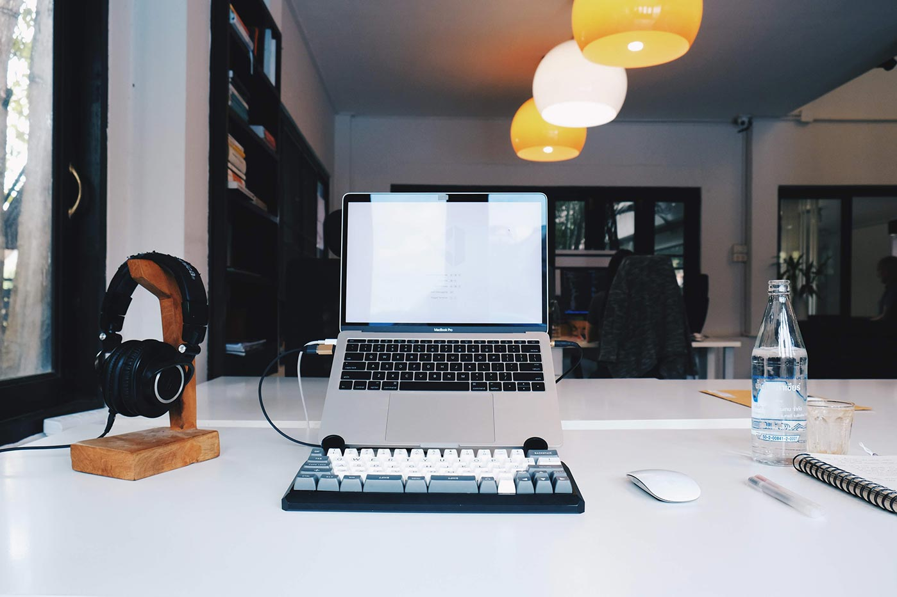
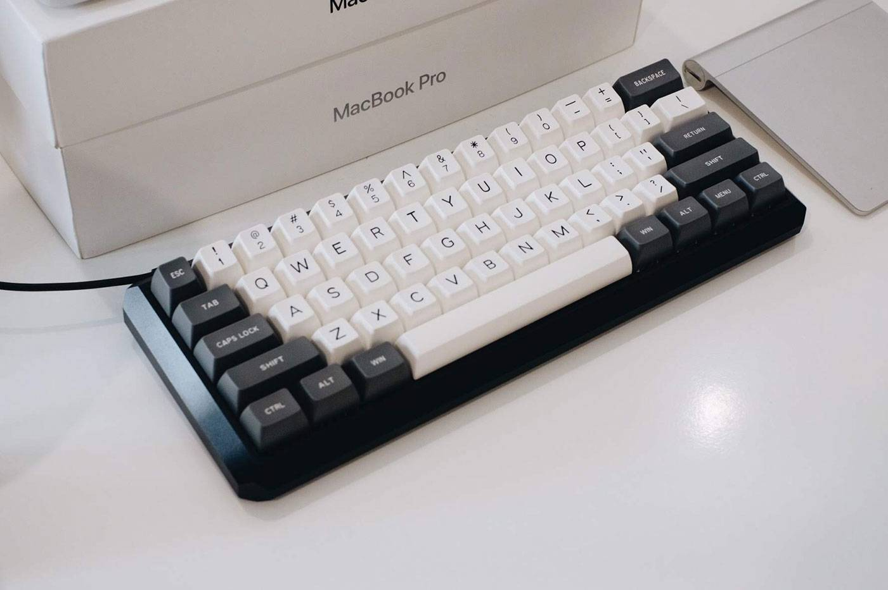
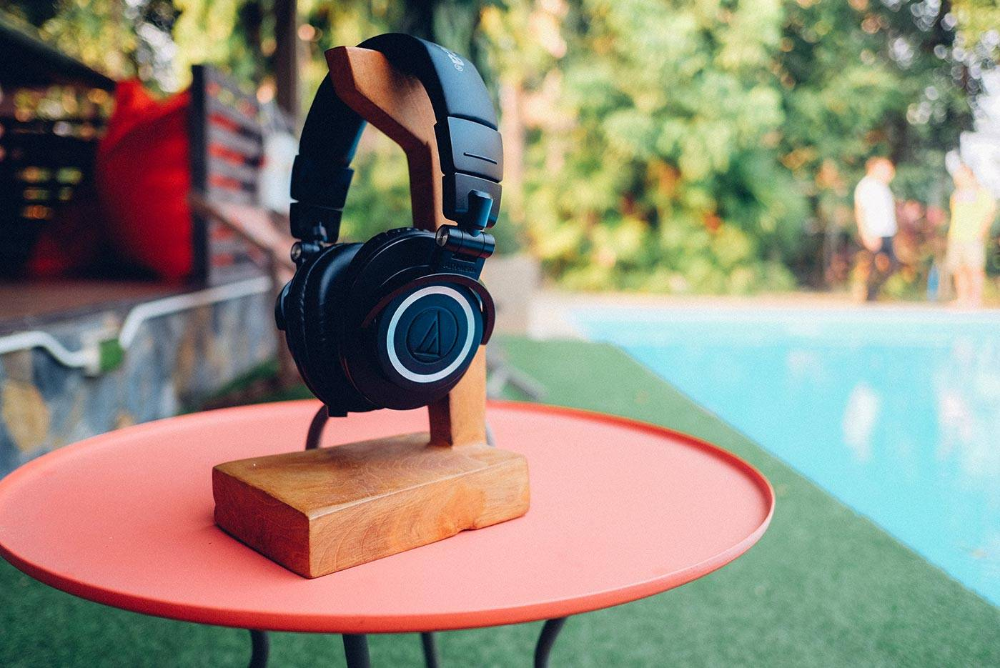
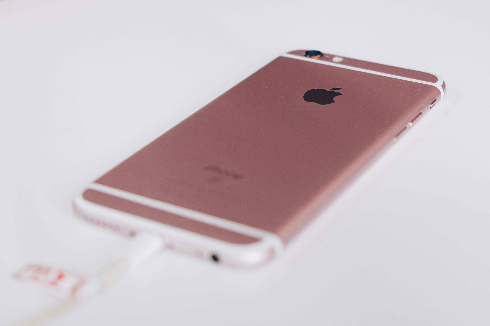
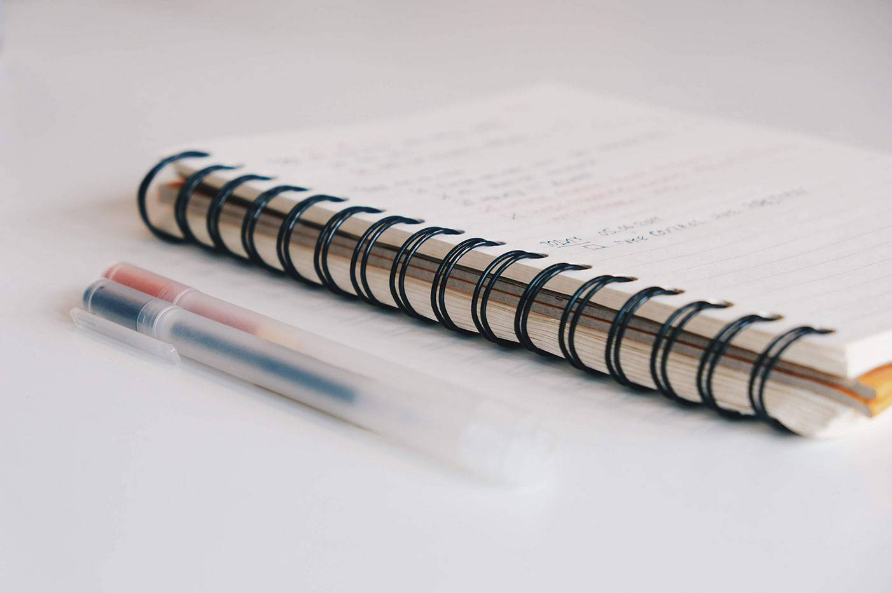
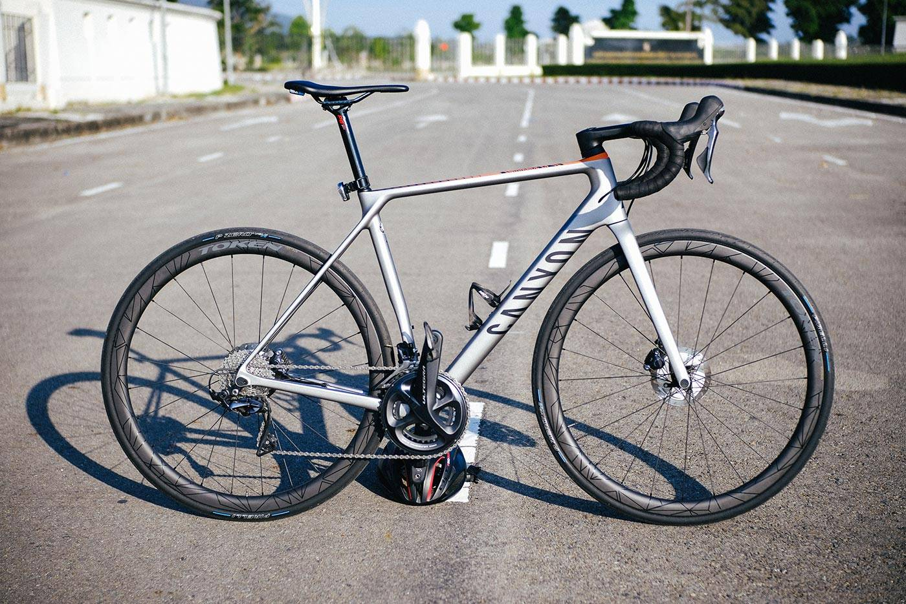

ได้แรงบันดาลใจมาจากหน้า [wesbos/uses](https://github.com/wesbos/awesome-uses) ที่ blogger หลายๆ คนแชร์ hardware กับ software ที่ใช้เป็นประจำผ่านหน้า `/uses` ของบล็อกตัวเอง

ที่ผมใช้ประจำมีประมาณนี้ครับ

## Hardware

- [2016, 13-inch MacBook Pro](https://support.apple.com/kb/SP747?locale=en_US) (2GHz, 16GB RAM) (work),
[2013, 13-inch MacBook Pro](https://support.apple.com/kb/SP691?locale=en_US) (2.3GHz, 8GB RAM) (home)

ที่ทำงาน เลือกใช้ MacBook Pro ไม่ได้ต่อจอหรืออุปกรณ์ต่อพ่วงอะไรมาก โต๊ะเลยโล่งๆ

- Custom mechanical keyboard ขนาด 60% ที่ทำใช้เอง เขียนบันทึกไว้ที่[โพสต์นี้](https://armno.in.th/2019/05/01/custom-mechanical-keyboard-build-2/)

- Apple Magic Mouse ของออฟฟิศ

- หูฟัง Audio-Technica M50x เคยเขียน[รีวิว](https://armno.in.th/2015/08/04/audio-technica-ath-m50x/)ไว้เหมือนกัน

- กล้องดิจิตอล Fuji XT-20 เลนส์ 18-55mm F2.8-4, Meike 35mm F1.7 ยืมของภรรยามาใช้ประจำ
- iPhone 6s ของเก่าของภรรยาเช่นกัน (ถึงได้เป็นสีชมพู)

- สมุดธรรมดาของออฟฟิศ ปากกา Muji สีดำ (0.38), แดง (0.5)

- จักรยาน 2018 Canyon Endurace CF SL ถึงไม่ได้เป็นอุปกรณ์ทำงาน แต่ก็เป็นส่วนสำคัญในชีวิตประจำวันเหมือนกัน ทั้งปั่นไปทำงาน (เป็นบางวัน) และปั่นออกกำลังกายด้วย

-----

## Software

- [VSCode](https://code.visualstudio.com/) เป็น code editor หลัก คู่กับ [VSCodeVim](https://github.com/VSCodeVim/Vim)
- [Vim](https://www.vim.org/) เป็น editor สำหรับไว้ใช้เวลาต้องแก้ไฟล์ใน terminal
- [iTerm2 Version 3](https://www.iterm2.com/version3.html)
- ฟอนต์ [Fira Code](https://armno.in.th/2017/08/10/fira-code-font-for-coding/)
- [Google Chrome](https://www.google.com/chrome/) เป็น browser หลัก
- [Spectacle](https://www.spectacleapp.com/) เป็นแอพย่อ-ขยายหน้าต่างใน macOS ด้วย hotkey ที่ตั้งได้ตามใจชอบ ฟรีด้วย
- [Trello](https://trello.com) สำหรับจดบันทึกอะไรที่ต้องเป็น list (todo list, wishlist), จดรายการหนังสือที่อ่านจบ
- [Alfred](https://www.alfredapp.com/) แทน Spotlight ใน macOS
- [Airmail](https://airmailapp.com/) แทนแอพ Mail ใน macOS เบากว่า และเร็วกว่าแอพ Mail เยอะ
- Adobe Photoshop & Lightroom
- [VSCO](https://vsco.co/)
